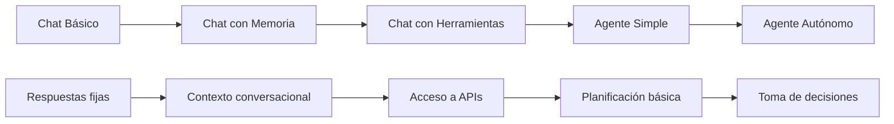

# Módulo A: Conceptos Esenciales
## Agentes vs Chat • JSON Estructurado • Seguridad Mínima

---

### 🎯 Objetivos del Módulo

Al finalizar este módulo serás capaz de:
- **Diferenciar** entre un chatbot tradicional y un agente de IA
- **Generar** salidas estructuradas en formato JSON válido  
- **Aplicar** reglas básicas de seguridad en sistemas de IA
- **Identificar** cuándo usar cada tipo de sistema

**⏱️ Duración estimada:** 2-3 horas  
**🔧 Prerrequisitos:** Python básico, APIs REST, conceptos de JSON

---

## 1. ¿Qué es un Agente de IA?

### 1.1 Definición

Un **agente de IA** es un sistema que puede:
- 🧠 **Percibir** su entorno y contexto
- 🎯 **Planificar** acciones para alcanzar objetivos
- 🛠️ **Actuar** usando herramientas externas
- 📊 **Evaluar** resultados y adaptarse

### 1.2 Componentes Clave

```
┌─────────────────────────────────────────┐
│              AGENTE DE IA               │
├─────────────────────────────────────────┤
│  ┌─────────┐  ┌─────────┐  ┌─────────┐  │
│  │ PLANNER │→ │EXECUTOR │→ │ CRITIC  │  │
│  └─────────┘  └─────────┘  └─────────┘  │
│       ↓            ↓            ↓       │
│   Genera       Ejecuta      Evalúa     │
│   planes       acciones    resultados   │
└─────────────────────────────────────────┘
```

### 1.3 Ejemplos Prácticos Detallados

#### Ejemplo 1: Gestión de Tareas Complejas

**Escenario:** "Busca información sobre el clima en Madrid y programa un recordatorio"

**Chat tradicional:**
```
Usuario: "¿Qué tiempo hace en Madrid?"
Bot: "No puedo acceder a información del clima en tiempo real."
```

**Agente de IA:**
```
Usuario: "Busca información sobre el clima en Madrid y programa un recordatorio"

Agente:
1. 🔍 PLAN: Necesito obtener clima + crear recordatorio
2. 🌤️ EJECUTO: Llamo API del clima → "Soleado, 22°C"
3. ⏰ EJECUTO: Creo recordatorio → "Recordatorio creado para mañana"
4. ✅ EVALÚO: Ambas tareas completadas exitosamente
5. 💬 RESPONDO: "En Madrid hace 22°C y está soleado. He creado un recordatorio para mañana."
```

#### Ejemplo 2: Análisis de Datos y Toma de Decisiones

**Escenario:** "Analiza las ventas del último trimestre y sugiere estrategias"

**Chat tradicional:**
```
Usuario: "¿Cómo van las ventas?"
Bot: "No tengo acceso a datos de ventas actuales."
```

**Agente de IA:**
```
Usuario: "Analiza las ventas del último trimestre y sugiere estrategias"

Agente:
1. 🔍 PLAN: Acceder a datos → Analizar tendencias → Generar estrategias
2. 📊 EJECUTO: Consulto base de datos → "Ventas Q3: -15% vs Q2"
3. 📈 EJECUTO: Analizo por producto → "Producto A: -30%, Producto B: +10%"
4. 🎯 EJECUTO: Genero estrategias → "Enfocar marketing en Producto A"
5. ✅ EVALÚO: Análisis completo con 3 recomendaciones específicas
6. 💬 RESPONDO: Reporte detallado con gráficos y plan de acción
```

#### Ejemplo 3: Automatización de Flujos de Trabajo

**Escenario:** "Si baja el inventario de productos, contacta a proveedores"

**Chat tradicional:**
```
Usuario: "¿Puedes monitorear el inventario?"
Bot: "No puedo ejecutar tareas de monitoreo continuo."
```

**Agente de IA:**
```
Agente (automáticamente):
1. 🔍 MONITOREO: Reviso inventario cada hora
2. ⚠️ DETECTO: Producto X tiene 5 unidades (límite: 10)
3. 📧 EJECUTO: Envío email a proveedor con orden automática
4. 📱 EJECUTO: Notifico al gerente de compras
5. ✅ EVALÚO: Orden enviada, timeline de reposición confirmado
6. 💬 ACTUALIZO: Dashboard con estado actual
```

---

## 2. Chat vs Agente: Diferencias Clave

### 2.1 Tabla Comparativa Detallada

| Aspecto | Chat Tradicional | Agente de IA | Ejemplo Práctico |
|---------|------------------|--------------|------------------|
| **Flujo** | Entrada → Proceso → Salida | Observar → Planificar → Actuar → Evaluar | Chat: "¿Qué es Python?" → respuesta. Agente: Analiza contexto → planifica explicación → ejecuta búsqueda → evalúa comprensión |
| **Memoria** | Conversación actual | Estado persistente + historial | Chat: Olvida contexto anterior. Agente: Recuerda preferencias, historial de tareas, estado de proyectos |
| **Herramientas** | Solo texto | Múltiples APIs y sistemas | Chat: Solo respuestas de texto. Agente: APIs, bases de datos, archivos, notificaciones |
| **Autonomía** | Reactivo | Proactivo | Chat: Espera preguntas. Agente: Monitorea, detecta problemas, actúa preventivamente |
| **Planificación** | No | Sí (objetivos a corto/largo plazo) | Chat: Una respuesta por vez. Agente: Planifica secuencias de 5-10 pasos |
| **Adaptabilidad** | Limitada | Alta | Chat: Respuestas fijas. Agente: Se adapta según feedback y contexto |

### 2.2 Casos de Uso Específicos

#### 🔄 Cuándo Usar Chat Tradicional

**Mejor para:**
- Preguntas simples de información
- FAQ y soporte básico  
- Consultas puntuales
- Cuando no se requiere estado/memoria

**Ejemplos:**
```
✅ "¿Cuál es la capital de Francia?"
✅ "¿Cómo se dice 'hola' en japonés?"
✅ "¿Qué significa REST API?"
✅ "Explica qué es un array"
```

#### 🤖 Cuándo Usar Agentes de IA

**Mejor para:**
- Tareas multi-paso complejas
- Integración con sistemas externos
- Workflows automatizados
- Análisis y toma de decisiones

**Ejemplos:**
```
✅ "Analiza el rendimiento de nuestro sitio web y optimízalo"
✅ "Gestiona el inventario y haz pedidos cuando sea necesario"
✅ "Revisa este código y sugiere mejoras de seguridad"
✅ "Programa reuniones considerando disponibilidad de todos"
```

### 2.3 Evolución: De Chat a Agente



### 2.2 Cuándo Usar Cada Uno

**Usa Chat cuando:**
- ✅ Necesitas respuestas rápidas e informativas
- ✅ La interacción es conversacional simple
- ✅ No requieres acciones externas
- ✅ El contexto es limitado

**Usa Agente cuando:**
- ✅ Necesitas realizar múltiples tareas
- ✅ Requieres integración con sistemas externos
- ✅ El objetivo es complejo o tiene múltiples pasos
- ✅ Necesitas adaptación basada en resultados

---

## 3. JSON Estructurado para Agentes

### 3.1 ¿Por Qué JSON?

Los agentes necesitan generar salidas **procesables** por otros sistemas:
- 🔧 **Integración** con APIs y bases de datos
- 🤖 **Automatización** de flujos de trabajo  
- ✅ **Validación** de formato y contenido
- 📊 **Análisis** y métricas posteriores

### 3.2 Schema Básico para Agentes

```json
{
  "$schema": "http://json-schema.org/draft-07/schema#",
  "type": "object",
  "properties": {
    "action": {
      "type": "string",
      "enum": ["search", "create", "update", "delete", "analyze", "respond"]
    },
    "parameters": {
      "type": "object",
      "description": "Parámetros específicos para la acción"
    },
    "reasoning": {
      "type": "string",
      "description": "Justificación de por qué se eligió esta acción"
    },
    "confidence": {
      "type": "number",
      "minimum": 0,
      "maximum": 1,
      "description": "Nivel de confianza (0-1)"
    }
  },
  "required": ["action", "parameters"]
}
```

### 3.3 Ejemplos de Salidas Estructuradas

**Ejemplo 1: Búsqueda**
```json
{
  "action": "search",
  "parameters": {
    "query": "machine learning python tutorials",
    "max_results": 5,
    "filter": "recent"
  },
  "reasoning": "El usuario busca tutoriales recientes para aprender ML con Python",
  "confidence": 0.85
}
```

**Ejemplo 2: Creación de Tarea**
```json
{
  "action": "create",
  "parameters": {
    "type": "task",
    "title": "Revisar código del módulo de autenticación",
    "due_date": "2025-08-20",
    "priority": "high"
  },
  "reasoning": "Detecté problemas de seguridad que requieren revisión urgente",
  "confidence": 0.92
}
```

---

## 4. Seguridad Mínima para Agentes

### 4.1 Principios Fundamentales

1. **🔐 Validación de Entrada**
   - Sanitizar todas las entradas del usuario
   - Limitar longitud y caracteres permitidos
   - Detectar patrones maliciosos

2. **🛡️ Principio de Menor Privilegio**
   - Solo otorgar acceso a herramientas necesarias
   - Limitar scope de cada herramienta
   - Implementar timeouts

3. **📝 Logging y Auditoría**
   - Registrar todas las acciones del agente
   - Monitorear patrones anómalos
   - Mantener trazabilidad completa

### 4.2 Implementación Práctica

**Validación de Entrada:**
```python
import re
from typing import List

class InputValidator:
    def __init__(self):
        self.max_length = 1000
        self.blocked_patterns = [
            r'eval\(',
            r'exec\(',
            r'__import__',
            r'subprocess',
            r'os\.',
            r'system\('
        ]
    
    def validate(self, user_input: str) -> bool:
        # Verificar longitud
        if len(user_input) > self.max_length:
            return False
        
        # Verificar patrones bloqueados
        for pattern in self.blocked_patterns:
            if re.search(pattern, user_input, re.IGNORECASE):
                return False
        
        return True
```

**Control de Herramientas:**
```python
class SafeToolRegistry:
    def __init__(self):
        self.allowed_tools = {
            'search_documents',
            'get_weather', 
            'calculate',
            'format_response'
        }
        
        self.blocked_tools = {
            'execute_code',
            'file_system_access',
            'network_request'
        }
    
    def is_tool_allowed(self, tool_name: str) -> bool:
        return (tool_name in self.allowed_tools and 
                tool_name not in self.blocked_tools)
```

### 4.3 Checklist de Seguridad

Antes de implementar un agente, verifica:

- [ ] **Validación de entrada** implementada
- [ ] **Lista blanca de herramientas** definida
- [ ] **Timeouts** configurados (< 30 segundos)
- [ ] **Logging** de acciones habilitado
- [ ] **Límites de recursos** establecidos
- [ ] **Filtros de salida** aplicados
- [ ] **Pruebas de seguridad** realizadas

---

## 5. Laboratorio Práctico

### 5.1 Ejercicio: Chat vs Agente

**Objetivo:** Comparar implementaciones básicas

**Archivo:** `labs/module-a/chat_vs_agent.py`

```python
# Implementarás ambos sistemas y compararás comportamiento
class SimpleChat:
    def respond(self, message: str) -> str:
        # TODO: Implementar respuesta directa
        pass

class SimpleAgent:
    def process(self, goal: str) -> dict:
        # TODO: Implementar ciclo planificar-ejecutar-evaluar
        pass
```

### 5.2 Ejercicio: JSON Estructurado

**Objetivo:** Generar salidas válidas con schema

**Archivo:** `labs/module-a/structured_output.py`

```python
# Validarás y generarás JSON siguiendo el schema definido
def generate_agent_response(action: str, params: dict) -> dict:
    # TODO: Crear respuesta estructurada válida
    pass
```

### 5.3 Ejercicio: Validación de Seguridad

**Objetivo:** Implementar filtros básicos

**Archivo:** `labs/module-a/security_validator.py`

```python
# Implementarás validadores siguiendo safety.min.yaml
def validate_user_input(input_text: str) -> tuple[bool, str]:
    # TODO: Validar entrada según reglas de seguridad
    pass
```

---

## 6. Quiz de Evaluación

### Pregunta 1
¿Cuál es la principal diferencia entre un chat y un agente?

- [ ] a) Los agentes usan más tokens
- [ ] b) Los chats son más rápidos
- [x] c) Los agentes pueden planificar y usar herramientas externas
- [ ] d) No hay diferencia significativa

### Pregunta 2
¿Qué componente NO es esencial en un schema JSON para agentes?

- [ ] a) action
- [x] b) timestamp
- [ ] c) parameters
- [ ] d) reasoning

### Pregunta 3
¿Cuál es el primer paso en la validación de seguridad?

- [x] a) Sanitizar y validar entrada del usuario
- [ ] b) Ejecutar la acción solicitada
- [ ] c) Generar logs del sistema
- [ ] d) Verificar permisos de salida

---

## 7. Recursos Adicionales

### 7.1 Plantillas Descargables
- 📄 [`safety.min.yaml`](../../templates/safety.min.yaml) - Configuración de seguridad
- 📄 [`plan-spec.json`](../../templates/plan-spec.json) - Schema para planes de agente

### 7.2 Lecturas Recomendadas
- [OpenAI Function Calling Guide](https://platform.openai.com/docs/guides/function-calling)
- [JSON Schema Specification](https://json-schema.org/)
- [OWASP AI Security Guidelines](https://owasp.org/www-project-ai-security-and-privacy-guide/)

### 7.3 Cheat Sheet
```
AGENTE = PLANIFICAR + EJECUTAR + EVALUAR
JSON = ESTRUCTURA + VALIDACIÓN + INTEGRACIÓN  
SEGURIDAD = VALIDAR + LIMITAR + AUDITAR
```

---

## ✅ Siguiente Paso

Una vez completado este módulo, estarás listo para **Módulo B: Primer Mini-Agente**, donde implementarás tu primer agente siguiendo el patrón Planner-Executor-Critic.

**🎯 Meta del próximo módulo:** Crear un agente funcional que pueda planificar, ejecutar y evaluar tareas simples.

---

*¿Tienes dudas? Revisa la sección de [FAQs](../faqs.md) o consulta el [glosario](../glosario.md).*
