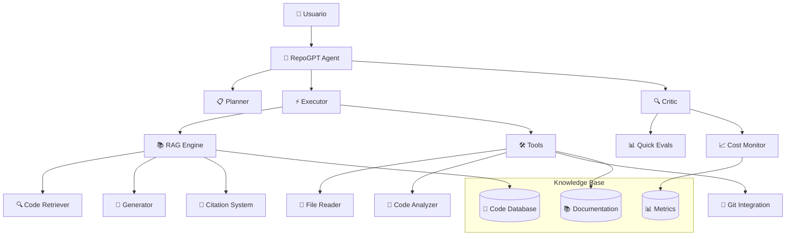

# Módulo E: Capstone Project - Agente IA Completo

## 🎯 Objetivos del Capstone

Al completar este proyecto capstone, habrás construido:

1. **Un agente IA completo** que integra PEC + RAG + Evaluación
2. **Sistema de gestión de conocimiento** sobre un repositorio real
3. **Pipeline de evaluación automática** con métricas de calidad
4. **Dashboard de monitoring** para coste y performance
5. **Documentación profesional** lista para producción

---

## 📋 Descripción del Proyecto

### El Challenge: **RepoGPT - Asistente IA para Repositorios**

Construirás **RepoGPT**, un agente inteligente que puede:

- 📖 **Analizar repositorios** de código (GitHub/local)
- 🔍 **Responder preguntas** técnicas sobre el código
- 🏗️ **Sugerir mejoras** y detectar patrones
- 📚 **Generar documentación** automática
- 🧪 **Auto-evaluarse** con métricas de calidad

### Arquitectura del Sistema



---

## 🚀 Especificaciones Técnicas

### 1. Componentes Requeridos

| Componente | Fuente | Descripción |
|------------|--------|-------------|
| **PEC Agent** | Módulo B | Arquitectura Planner-Executor-Critic |
| **RAG System** | Módulo C | Retrieval con citas canónicas |
| **Quick Evals** | Módulo D | Evaluación automática de respuestas |
| **Cost Monitor** | Módulo D | Tracking de costes y latencia |

### 2. Funcionalidades Core

#### 2.1 Gestión de Repositorios
```python
# Ejemplos de funcionalidades
repo_agent.load_repository("path/to/repo")
repo_agent.index_codebase()
repo_agent.update_knowledge_base()
```

#### 2.2 Consultas Inteligentes
```python
# Tipos de consultas soportadas
queries = [
    "¿Cómo funciona la autenticación en este proyecto?",
    "¿Cuáles son los patrones de diseño utilizados?",
    "¿Qué dependencias tiene el módulo X?",
    "Genera documentación para la clase Y",
    "¿Hay código duplicado en el proyecto?"
]
```

#### 2.3 Auto-evaluación
```python
# Evaluación automática de respuestas
evaluation_results = {
    "relevance_score": 0.89,
    "citation_accuracy": 0.95,
    "code_understanding": 0.87,
    "response_quality": 0.91
}
```

---

## 📝 Requisitos del Entregable

### 1. Código Fuente ✅

**Archivo principal:** `capstone/repogpt.py`

Debe incluir:
- [x] Clase `RepoGPTAgent` que integre PEC + RAG
- [x] Sistema de indexación de código
- [x] Pipeline de consultas con evaluación
- [x] Interfaz de línea de comandos
- [x] Configuración de modelos y parámetros

### 2. Knowledge Base de Ejemplo ✅

**Archivo:** `capstone/sample_repo/`

Repositorio de ejemplo con:
- [x] Código Python bien documentado
- [x] README, requirements, tests
- [x] Estructura típica de proyecto
- [x] Casos de uso diversos

### 3. Suite de Evaluación ✅

**Archivo:** `capstone/evaluation_suite.py`

Debe incluir:
- [x] Test cases específicos para el repositorio
- [x] Métricas de calidad automatizadas
- [x] Benchmarks de performance
- [x] Reportes de evaluación

### 4. Documentación Completa ✅

**Archivo:** `capstone/README.md`

Debe incluir:
- [x] Descripción del proyecto
- [x] Guía de instalación y uso
- [x] Arquitectura y decisiones técnicas
- [x] Resultados de evaluación
- [x] Limitaciones y mejoras futuras

---

## 🎯 Criterios de Evaluación

### Rúbrica de Calificación (100 puntos)

| Criterio | Peso | Excelente (90-100%) | Bueno (70-89%) | Suficiente (50-69%) | Insuficiente (<50%) |
|----------|------|---------------------|----------------|---------------------|---------------------|
| **Integración Técnica** | 25% | Todos los módulos integrados perfectamente | Integración funcional con bugs menores | Integración básica, algunos componentes fallan | Integración incompleta o no funcional |
| **Funcionalidad RAG** | 20% | RAG funciona con citas precisas y retrieval relevante | RAG funcional, citas ocasionalmente incorrectas | RAG básico, retrieval poco preciso | RAG no funcional o muy limitado |
| **Calidad del Código** | 15% | Código limpio, bien estructurado y documentado | Código funcional con documentación adecuada | Código funcional pero poco documentado | Código difícil de seguir o con errores |
| **Auto-evaluación** | 15% | Sistema de evaluación completo y automático | Evaluación funcional con métricas básicas | Evaluación manual o muy limitada | Sin sistema de evaluación |
| **Usabilidad** | 10% | Interfaz intuitiva y fácil de usar | Interfaz funcional pero poco pulida | Interfaz básica pero usable | Interfaz confusa o no funcional |
| **Documentación** | 10% | Documentación completa y profesional | Documentación adecuada con ejemplos | Documentación básica pero suficiente | Documentación insuficiente o ausente |
| **Innovación** | 5% | Características únicas o mejoras significativas | Algunas mejoras sobre los requisitos básicos | Cumple requisitos sin mejoras adicionales | Por debajo de los requisitos mínimos |

### Umbrales de Aprobación

- **🏆 Excelente:** 85+ puntos - Listo para producción
- **✅ Aprobado:** 70+ puntos - Funcional con mejoras menores
- **⚠️ Necesita Mejoras:** 50-69 puntos - Requiere refinamiento
- **❌ No Aprobado:** <50 puntos - Requiere trabajo adicional

---

## 🛠️ Guía de Implementación

### Fase 1: Setup del Proyecto (30 min)

1. **Crear estructura del proyecto**
```bash
capstone/
├── repogpt.py              # Agente principal
├── config/
│   ├── models.yaml         # Configuración de modelos
│   └── evaluation.yaml     # Configuración de evaluación
├── sample_repo/            # Repositorio de ejemplo
├── evaluation_suite.py     # Suite de evaluación
├── requirements.txt        # Dependencias
└── README.md              # Documentación
```

2. **Configurar dependencias**
```python
# requirements.txt
# Módulos del curso
# + dependencias adicionales para file handling, git, etc.
```

### Fase 2: Integración de Módulos (60 min)

1. **Importar y adaptar PEC Agent** (Módulo B)
2. **Integrar RAG Engine** (Módulo C)
3. **Conectar Quick Evals** (Módulo D)
4. **Añadir Cost Monitoring** (Módulo D)

### Fase 3: Funcionalidades Específicas (45 min)

1. **Code Indexing:** Parser de archivos Python/JS/etc
2. **Repository Analysis:** Estructura, dependencias, patrones
3. **Query Processing:** Manejo de consultas técnicas
4. **Documentation Generation:** Auto-generación de docs

### Fase 4: Testing y Evaluación (30 min)

1. **Crear test cases** para el repositorio ejemplo
2. **Ejecutar evaluaciones** automáticas
3. **Generar reportes** de performance
4. **Optimizar** basado en métricas

### Fase 5: Documentación y Pulido (15 min)

1. **Escribir README** completo
2. **Documentar API** y configuración
3. **Añadir ejemplos** de uso
4. **Preparar demo** final

---

## 💡 Ideas para Extensiones Avanzadas

### Características Bonus (Opcional)

1. **🌐 Multi-Language Support**
   - Soporte para JavaScript, TypeScript, Java
   - Parsers específicos por lenguaje

2. **🔄 Git Integration**
   - Análisis de commits y branches
   - Detección de cambios en código

3. **📊 Advanced Analytics**
   - Métricas de complejidad de código
   - Análisis de deuda técnica

4. **🎨 Web Interface**
   - Dashboard web con Streamlit/Flask
   - Visualización de métricas

5. **🚀 Performance Optimization**
   - Caching de embeddings
   - Indexación incremental

---

## 📚 Recursos y Referencias

### Datasets de Ejemplo

- **FastAPI Codebase:** API REST moderna
- **Pandas Subset:** Análisis de datos
- **Flask Microservice:** Aplicación web simple

### Herramientas Recomendadas

- **AST Parsing:** `ast` module de Python
- **Git Integration:** `GitPython` library
- **Code Analysis:** `pylint`, `flake8`
- **Documentation:** `sphinx`, `mkdocs`

### Métricas de Referencia

| Métrica | Target | Excelente |
|---------|--------|-----------|
| Retrieval Precision@5 | >0.7 | >0.85 |
| Citation Accuracy | >0.8 | >0.95 |
| Response Relevance | >0.75 | >0.9 |
| Query Response Time | <3s | <1s |
| Cost per Query | <$0.05 | <$0.02 |

---

## 🎉 Presentación Final

### Demo Day Checklist

- [ ] **5-min Presentation:** Arquitectura y características clave
- [ ] **Live Demo:** Consultas en tiempo real al repositorio
- [ ] **Metrics Review:** Resultados de evaluación automática
- [ ] **Code Walkthrough:** Explicación de decisiones técnicas
- [ ] **Q&A Session:** Preguntas sobre implementación

### Entregables Finales

1. **Código fuente completo** en repositorio Git
2. **README detallado** con guía de uso
3. **Video demo** (5-10 minutos) mostrando funcionalidades
4. **Reporte de evaluación** con métricas y análisis
5. **Reflexión técnica** (1-2 páginas) sobre aprendizajes

---

## ✅ Conclusión del Curso

Al completar este capstone habrás:

🎯 **Construido un agente IA completo** desde cero  
🔧 **Integrado múltiples tecnologías** de vanguardia  
📊 **Implementado evaluación automática** y monitoring  
🚀 **Creado un proyecto portfolio** para tu carrera  
🧠 **Dominado conceptos avanzados** de IA aplicada  

**¡Felicitaciones por completar el curso completo de Agentes IA!** 🎉

---

## 🔗 Próximos Pasos

- **Producción:** Deploy en la nube (AWS, GCP, Azure)
- **Escalabilidad:** Microservicios y containerización
- **Comunidad:** Contribuir a proyectos open source
- **Especialización:** Deep dive en LLMs, multimodal AI
- **Certificación:** Considera certificaciones oficiales en IA

**¡El viaje en IA apenas comienza!** 🚀
