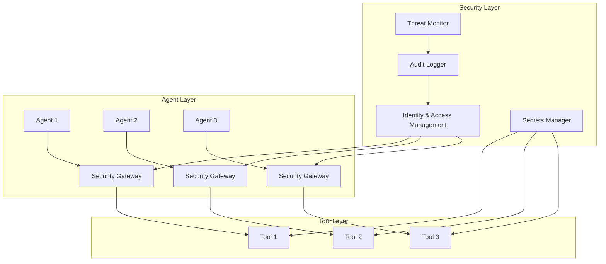

# ADR-004: Security-First Design Approach

**Status:** Accepted  
**Date:** 2024-08-17  
**Authors:** Mauricio Acuña  
**Reviewers:** Security Team, Technical Team  

## Context

Enterprise AI agent systems handle sensitive data, execute privileged operations, and integrate with critical business systems. Security must be designed into the architecture from the foundation, not added as an afterthought.

Key security requirements include:
1. **Zero-trust architecture** for agent-to-agent and agent-to-tool communication
2. **Secure secrets management** for API keys, credentials, and certificates
3. **Input validation and sanitization** to prevent injection attacks
4. **Audit trails and compliance** for regulatory requirements
5. **Resource isolation** to prevent resource exhaustion attacks
6. **Data privacy and encryption** both in transit and at rest

This decision affects every component of the agent architecture and establishes security as a foundational design principle.

## Decision

We will implement a **Security-First Design Approach** with the following core principles:

### Security-First Principles

1. **Zero Trust by Default:** Never trust, always verify
2. **Defense in Depth:** Multiple layers of security controls
3. **Principle of Least Privilege:** Minimal required permissions
4. **Fail Secure:** System fails to secure state, not open state
5. **Security Observability:** Comprehensive security monitoring and alerting

### Architecture Overview



## Security Framework Implementation

### 1. Zero-Trust Architecture

```python
class ZeroTrustSecurityGateway:
    """
    Zero-trust security gateway for all agent interactions
    Based on NIST Zero Trust Architecture principles
    """
    
    def __init__(self):
        self.identity_verifier = IdentityVerifier()
        self.authorization_engine = AuthorizationEngine()
        self.threat_detector = ThreatDetector()
        self.audit_logger = SecurityAuditLogger()
        self.rate_limiter = RateLimiter()
    
    async def secure_agent_request(self, request: AgentRequest) -> SecureRequestResult:
        """Process agent request through zero-trust pipeline"""
        
        # 1. Identity Verification
        identity = await self.verify_identity(request)
        if not identity.verified:
            await self.audit_logger.log_failed_authentication(request)
            raise SecurityException("Identity verification failed")
        
        # 2. Authorization Check
        authorized = await self.check_authorization(identity, request)
        if not authorized:
            await self.audit_logger.log_unauthorized_access(identity, request)
            raise SecurityException("Authorization failed")
        
        # 3. Threat Detection
        threat_score = await self.threat_detector.analyze_request(request, identity)
        if threat_score > THREAT_THRESHOLD:
            await self.audit_logger.log_potential_threat(request, threat_score)
            raise SecurityException("Potential threat detected")
        
        # 4. Rate Limiting
        if not await self.rate_limiter.allow_request(identity):
            await self.audit_logger.log_rate_limit_exceeded(identity)
            raise SecurityException("Rate limit exceeded")
        
        # 5. Request Sanitization
        sanitized_request = await self.sanitize_request(request)
        
        # 6. Audit Logging
        await self.audit_logger.log_successful_request(identity, sanitized_request)
        
        return SecureRequestResult(
            identity=identity,
            sanitized_request=sanitized_request,
            security_context=self.create_security_context(identity, request)
        )
    
    async def verify_identity(self, request: AgentRequest) -> AgentIdentity:
        """Verify agent identity using multiple factors"""
        
        # Primary authentication (JWT token)
        primary_auth = await self.identity_verifier.verify_jwt_token(request.auth_token)
        
        # Secondary authentication (certificate)
        secondary_auth = await self.identity_verifier.verify_certificate(request.certificate)
        
        # Behavioral verification
        behavioral_auth = await self.identity_verifier.verify_behavior_pattern(request)
        
        # Combine verification results
        identity = AgentIdentity(
            id=primary_auth.agent_id,
            verified=primary_auth.valid and secondary_auth.valid,
            trust_score=self.calculate_trust_score(primary_auth, secondary_auth, behavioral_auth),
            permissions=primary_auth.permissions,
            security_clearance=primary_auth.security_clearance
        )
        
        return identity
```

### 2. Secure Secrets Management

```python
class SecureSecretsManager:
    """
    Enterprise-grade secrets management following HashiCorp Vault patterns
    Supports key rotation, encryption, and audit trails
    """
    
    def __init__(self):
        self.vault_client = VaultClient()
        self.encryption_service = EncryptionService()
        self.key_rotation_manager = KeyRotationManager()
        self.audit_logger = SecretsAuditLogger()
    
    async def get_secret(self, secret_path: str, requester_identity: AgentIdentity) -> Secret:
        """Retrieve secret with access control and audit"""
        
        # Verify access permissions
        if not await self.verify_secret_access(secret_path, requester_identity):
            await self.audit_logger.log_unauthorized_secret_access(
                secret_path, requester_identity
            )
            raise SecurityException("Unauthorized secret access")
        
        # Retrieve encrypted secret
        encrypted_secret = await self.vault_client.get_secret(secret_path)
        
        # Decrypt secret
        secret = await self.encryption_service.decrypt(
            encrypted_secret,
            requester_identity.encryption_key
        )
        
        # Log successful access
        await self.audit_logger.log_secret_access(
            secret_path,
            requester_identity,
            access_type="read"
        )
        
        # Set expiration and usage tracking
        secret.expires_at = datetime.utcnow() + timedelta(hours=1)
        secret.max_uses = 100
        
        return secret
    
    async def rotate_secrets(self) -> RotationResult:
        """Automatic secret rotation based on policy"""
        
        rotation_policies = await self.get_rotation_policies()
        rotation_results = []
        
        for policy in rotation_policies:
            if await self.should_rotate(policy):
                try:
                    # Generate new secret
                    new_secret = await self.generate_secret(policy.secret_type)
                    
                    # Update vault
                    await self.vault_client.update_secret(policy.secret_path, new_secret)
                    
                    # Notify dependent services
                    await self.notify_secret_rotation(policy.secret_path, policy.dependents)
                    
                    # Log rotation
                    await self.audit_logger.log_secret_rotation(policy.secret_path)
                    
                    rotation_results.append(RotationSuccess(policy.secret_path))
                    
                except Exception as e:
                    await self.audit_logger.log_rotation_failure(policy.secret_path, e)
                    rotation_results.append(RotationFailure(policy.secret_path, e))
        
        return RotationResult(rotation_results)
```

### 3. Input Validation and Sanitization

```python
class SecurityValidator:
    """
    Comprehensive input validation and sanitization
    Prevents injection attacks and malicious payloads
    """
    
    def __init__(self):
        self.sql_injection_detector = SQLInjectionDetector()
        self.command_injection_detector = CommandInjectionDetector()
        self.xss_detector = XSSDetector()
        self.prompt_injection_detector = PromptInjectionDetector()
        self.sanitizer = InputSanitizer()
    
    async def validate_and_sanitize(self, input_data: Dict, input_schema: InputSchema) -> ValidatedInput:
        """Validate and sanitize all input data"""
        
        validation_results = []
        sanitized_data = {}
        
        for field_name, field_value in input_data.items():
            field_schema = input_schema.get_field_schema(field_name)
            
            # Type validation
            type_valid = await self.validate_type(field_value, field_schema.type)
            if not type_valid:
                raise ValidationException(f"Invalid type for field {field_name}")
            
            # Security validation
            security_result = await self.validate_security(field_value, field_schema)
            if not security_result.safe:
                raise SecurityException(f"Security violation in field {field_name}: {security_result.threat_type}")
            
            # Sanitization
            sanitized_value = await self.sanitizer.sanitize(field_value, field_schema)
            sanitized_data[field_name] = sanitized_value
            
            validation_results.append(FieldValidationResult(
                field_name=field_name,
                original_value=field_value,
                sanitized_value=sanitized_value,
                security_result=security_result
            ))
        
        return ValidatedInput(
            original_data=input_data,
            sanitized_data=sanitized_data,
            validation_results=validation_results
        )
    
    async def validate_security(self, value: str, schema: FieldSchema) -> SecurityValidationResult:
        """Comprehensive security validation"""
        
        threats_detected = []
        
        # SQL Injection Detection
        if await self.sql_injection_detector.detect(value):
            threats_detected.append("sql_injection")
        
        # Command Injection Detection
        if await self.command_injection_detector.detect(value):
            threats_detected.append("command_injection")
        
        # XSS Detection
        if await self.xss_detector.detect(value):
            threats_detected.append("xss")
        
        # Prompt Injection Detection (AI-specific)
        if await self.prompt_injection_detector.detect(value):
            threats_detected.append("prompt_injection")
        
        # Custom validation rules
        for rule in schema.security_rules:
            if not await rule.validate(value):
                threats_detected.append(rule.threat_type)
        
        return SecurityValidationResult(
            safe=len(threats_detected) == 0,
            threats_detected=threats_detected,
            risk_score=self.calculate_risk_score(threats_detected)
        )
```

### 4. Audit Trails and Compliance

```python
class ComplianceAuditLogger:
    """
    Comprehensive audit logging for regulatory compliance
    Supports SOC2, GDPR, HIPAA, and other frameworks
    """
    
    def __init__(self):
        self.audit_storage = AuditStorage()
        self.encryption_service = EncryptionService()
        self.compliance_validator = ComplianceValidator()
        self.alert_manager = SecurityAlertManager()
    
    async def log_agent_action(self, action: AgentAction, context: SecurityContext) -> AuditLogEntry:
        """Log agent action with full compliance metadata"""
        
        audit_entry = AuditLogEntry(
            timestamp=datetime.utcnow(),
            event_type="agent_action",
            agent_id=context.identity.id,
            action_type=action.type,
            resource_accessed=action.resource,
            data_classification=action.data_classification,
            compliance_tags=self.get_compliance_tags(action),
            security_context=context,
            request_id=action.request_id,
            session_id=context.session_id
        )
        
        # Encrypt sensitive audit data
        if audit_entry.contains_sensitive_data():
            audit_entry = await self.encryption_service.encrypt_audit_entry(audit_entry)
        
        # Validate compliance requirements
        compliance_result = await self.compliance_validator.validate_entry(audit_entry)
        if not compliance_result.compliant:
            await self.alert_manager.send_compliance_alert(audit_entry, compliance_result)
        
        # Store audit entry
        await self.audit_storage.store_entry(audit_entry)
        
        # Real-time threat detection
        await self.analyze_for_threats(audit_entry)
        
        return audit_entry
    
    async def generate_compliance_report(self, 
                                       start_date: datetime, 
                                       end_date: datetime, 
                                       compliance_framework: str) -> ComplianceReport:
        """Generate compliance report for specific framework"""
        
        # Retrieve relevant audit entries
        audit_entries = await self.audit_storage.get_entries_by_date_range(
            start_date, end_date
        )
        
        # Filter by compliance framework
        relevant_entries = [
            entry for entry in audit_entries 
            if compliance_framework in entry.compliance_tags
        ]
        
        # Generate report sections
        report_sections = await self.generate_report_sections(
            relevant_entries, compliance_framework
        )
        
        # Validate completeness
        completeness_check = await self.validate_report_completeness(
            report_sections, compliance_framework, start_date, end_date
        )
        
        return ComplianceReport(
            framework=compliance_framework,
            period_start=start_date,
            period_end=end_date,
            sections=report_sections,
            completeness=completeness_check,
            generated_at=datetime.utcnow()
        )
```

### 5. Resource Isolation and Protection

```python
class ResourceIsolationManager:
    """
    Resource isolation to prevent resource exhaustion and ensure fair usage
    Implements container-like isolation for agent resources
    """
    
    def __init__(self):
        self.resource_monitor = ResourceMonitor()
        self.isolation_engine = IsolationEngine()
        self.quota_manager = QuotaManager()
        self.circuit_breaker = CircuitBreaker()
    
    async def create_agent_sandbox(self, agent_identity: AgentIdentity) -> AgentSandbox:
        """Create isolated resource sandbox for agent"""
        
        # Determine resource quotas based on agent type and security clearance
        quotas = await self.quota_manager.calculate_quotas(agent_identity)
        
        # Create isolated environment
        sandbox = await self.isolation_engine.create_sandbox(
            agent_id=agent_identity.id,
            cpu_limit=quotas.cpu_limit,
            memory_limit=quotas.memory_limit,
            disk_limit=quotas.disk_limit,
            network_policies=quotas.network_policies,
            file_system_isolation=True
        )
        
        # Initialize monitoring
        await self.resource_monitor.start_monitoring(sandbox)
        
        return sandbox
    
    async def enforce_resource_limits(self, sandbox: AgentSandbox, operation: AgentOperation) -> EnforcementResult:
        """Enforce resource limits during operation execution"""
        
        # Pre-execution checks
        resource_check = await self.check_resource_availability(sandbox, operation)
        if not resource_check.sufficient:
            return EnforcementResult(
                allowed=False,
                reason="Insufficient resources",
                available_resources=resource_check.available
            )
        
        # Circuit breaker check
        if self.circuit_breaker.is_open(sandbox.agent_id):
            return EnforcementResult(
                allowed=False,
                reason="Circuit breaker open",
                retry_after=self.circuit_breaker.get_retry_time()
            )
        
        # Execute with monitoring
        try:
            with self.resource_monitor.track_operation(sandbox, operation):
                result = await self.execute_operation_with_limits(sandbox, operation)
            
            return EnforcementResult(
                allowed=True,
                result=result,
                resource_usage=self.resource_monitor.get_usage_stats(sandbox)
            )
            
        except ResourceExhaustionException as e:
            # Trigger circuit breaker
            await self.circuit_breaker.record_failure(sandbox.agent_id)
            
            # Log security event
            await self.log_resource_exhaustion_event(sandbox, operation, e)
            
            return EnforcementResult(
                allowed=False,
                reason="Resource exhaustion",
                error=e
            )
```

## Security Compliance Framework

### Industry Standards Integration

```python
class SecurityComplianceFramework:
    """
    Multi-framework compliance management
    Supports SOC2, GDPR, HIPAA, ISO 27001, NIST Cybersecurity Framework
    """
    
    SUPPORTED_FRAMEWORKS = {
        "SOC2": SOC2ComplianceHandler(),
        "GDPR": GDPRComplianceHandler(), 
        "HIPAA": HIPAAComplianceHandler(),
        "ISO27001": ISO27001ComplianceHandler(),
        "NIST_CSF": NISTCSFComplianceHandler()
    }
    
    def __init__(self):
        self.compliance_handlers = self.SUPPORTED_FRAMEWORKS
        self.audit_manager = ComplianceAuditManager()
        self.control_validator = ControlValidator()
    
    async def validate_compliance(self, operation: SecurityOperation, frameworks: List[str]) -> ComplianceValidationResult:
        """Validate operation against multiple compliance frameworks"""
        
        validation_results = {}
        
        for framework in frameworks:
            if framework in self.compliance_handlers:
                handler = self.compliance_handlers[framework]
                result = await handler.validate_operation(operation)
                validation_results[framework] = result
            else:
                raise UnsupportedFrameworkException(f"Framework {framework} not supported")
        
        # Aggregate results
        overall_compliant = all(result.compliant for result in validation_results.values())
        
        return ComplianceValidationResult(
            overall_compliant=overall_compliant,
            framework_results=validation_results,
            recommendations=self.generate_compliance_recommendations(validation_results)
        )
```

### Data Privacy and Encryption

```python
class DataPrivacyManager:
    """
    Comprehensive data privacy management
    Handles PII detection, encryption, anonymization, and retention
    """
    
    def __init__(self):
        self.pii_detector = PIIDetector()
        self.encryption_service = EncryptionService()
        self.anonymization_service = AnonymizationService()
        self.retention_manager = DataRetentionManager()
        self.consent_manager = ConsentManager()
    
    async def process_data_with_privacy(self, data: Dict, processing_purpose: str, agent_identity: AgentIdentity) -> PrivacyProcessingResult:
        """Process data while maintaining privacy compliance"""
        
        # 1. PII Detection
        pii_analysis = await self.pii_detector.analyze(data)
        
        # 2. Consent Verification
        if pii_analysis.contains_pii:
            consent_valid = await self.consent_manager.verify_consent(
                data_subject=pii_analysis.data_subject,
                processing_purpose=processing_purpose,
                agent_id=agent_identity.id
            )
            
            if not consent_valid:
                raise PrivacyException("No valid consent for PII processing")
        
        # 3. Data Minimization
        minimized_data = await self.minimize_data(data, processing_purpose)
        
        # 4. Encryption
        encrypted_data = await self.encryption_service.encrypt_data(
            minimized_data,
            encryption_level=self.determine_encryption_level(pii_analysis)
        )
        
        # 5. Anonymization (if required)
        if processing_purpose in ["analytics", "machine_learning"]:
            anonymized_data = await self.anonymization_service.anonymize(encrypted_data)
            final_data = anonymized_data
        else:
            final_data = encrypted_data
        
        # 6. Retention Policy
        retention_policy = await self.retention_manager.get_retention_policy(processing_purpose)
        await self.retention_manager.schedule_deletion(final_data, retention_policy)
        
        return PrivacyProcessingResult(
            original_data=data,
            processed_data=final_data,
            pii_analysis=pii_analysis,
            privacy_metadata=self.create_privacy_metadata(processing_purpose, retention_policy)
        )
```

## Security Testing and Validation

### Penetration Testing Framework

```python
class SecurityTestingFramework:
    """
    Automated security testing for AI agent systems
    Includes penetration testing, vulnerability scanning, and threat modeling
    """
    
    def __init__(self):
        self.vulnerability_scanner = VulnerabilityScanner()
        self.penetration_tester = PenetrationTester()
        self.threat_modeler = ThreatModeler()
        self.security_fuzzer = SecurityFuzzer()
    
    async def run_comprehensive_security_test(self, system: AgentSystem) -> SecurityTestResult:
        """Run comprehensive security testing suite"""
        
        test_results = []
        
        # 1. Vulnerability Scanning
        vuln_scan_result = await self.vulnerability_scanner.scan_system(system)
        test_results.append(vuln_scan_result)
        
        # 2. Penetration Testing
        pentest_result = await self.penetration_tester.test_system(system)
        test_results.append(pentest_result)
        
        # 3. Threat Modeling
        threat_model_result = await self.threat_modeler.model_threats(system)
        test_results.append(threat_model_result)
        
        # 4. Security Fuzzing
        fuzz_test_result = await self.security_fuzzer.fuzz_interfaces(system)
        test_results.append(fuzz_test_result)
        
        # 5. AI-Specific Security Tests
        ai_security_result = await self.test_ai_specific_vulnerabilities(system)
        test_results.append(ai_security_result)
        
        return SecurityTestResult(
            overall_security_score=self.calculate_security_score(test_results),
            test_results=test_results,
            critical_vulnerabilities=self.extract_critical_vulnerabilities(test_results),
            remediation_recommendations=self.generate_remediation_plan(test_results)
        )
    
    async def test_ai_specific_vulnerabilities(self, system: AgentSystem) -> AISecurityTestResult:
        """Test AI-specific security vulnerabilities"""
        
        ai_tests = [
            self.test_prompt_injection_resistance(system),
            self.test_model_extraction_resistance(system),
            self.test_data_poisoning_resistance(system),
            self.test_adversarial_input_handling(system),
            self.test_model_inversion_resistance(system)
        ]
        
        ai_test_results = await asyncio.gather(*ai_tests)
        
        return AISecurityTestResult(
            prompt_injection_resistance=ai_test_results[0],
            model_extraction_resistance=ai_test_results[1],
            data_poisoning_resistance=ai_test_results[2],
            adversarial_input_handling=ai_test_results[3],
            model_inversion_resistance=ai_test_results[4]
        )
```

## Decision Rationale

### Security vs Performance Trade-offs

| Security Control | Performance Impact | Security Benefit | Implementation Priority |
|------------------|-------------------|-------------------|------------------------|
| Zero-Trust Gateway | 15-25ms latency | Critical - prevents unauthorized access | High |
| Input Validation | 5-10ms per request | High - prevents injection attacks | High |
| Audit Logging | 2-5ms per operation | Critical - compliance requirement | High |
| Encryption at Rest | Minimal | High - data protection | Medium |
| Resource Isolation | 10-20% overhead | Medium - prevents DoS attacks | Medium |
| Threat Detection | 20-30ms analysis | High - proactive threat response | Medium |

### Compliance Coverage

```python
COMPLIANCE_MATRIX = {
    "SOC2": {
        "Type I": ["access_controls", "system_monitoring", "change_management"],
        "Type II": ["continuous_monitoring", "incident_response", "vendor_management"]
    },
    "GDPR": {
        "Article 25": ["data_protection_by_design", "data_minimization"],
        "Article 32": ["encryption", "access_controls", "incident_response"],
        "Article 35": ["privacy_impact_assessment", "data_protection_officer"]
    },
    "HIPAA": {
        "Administrative": ["security_officer", "workforce_training", "incident_procedures"],
        "Physical": ["facility_access", "workstation_use", "device_controls"],
        "Technical": ["access_control", "audit_controls", "integrity", "transmission_security"]
    }
}
```

## Consequences

### Positive
- ✅ **Enterprise-grade security** meeting regulatory requirements
- ✅ **Zero-trust architecture** providing defense in depth
- ✅ **Comprehensive audit trails** for compliance and forensics
- ✅ **Automated threat detection** and response capabilities
- ✅ **Data privacy protection** with encryption and anonymization
- ✅ **Resource isolation** preventing resource exhaustion attacks

### Negative
- ❌ **Performance overhead** from security controls (15-30% typical)
- ❌ **Implementation complexity** requiring security expertise
- ❌ **Operational overhead** for security monitoring and maintenance
- ❌ **Development velocity impact** from security review requirements

### Mitigation Strategies

1. **Performance:** Optimize hot paths, use caching, parallel processing
2. **Complexity:** Provide security frameworks and automated tools
3. **Operations:** Implement automated security monitoring and alerting
4. **Development:** Integrate security into CI/CD pipeline with automated checks

## Related ADRs

- [ADR-001: Choose PEC over ReAct Architecture](./001-pec-over-react.md) - Security integrates into each PEC phase
- [ADR-002: RAG with Citations over Fine-tuning](./002-rag-over-finetuning.md) - Citations support security auditing
- [ADR-003: Multi-Agent Patterns with Tool Orchestration](./003-multiagent-patterns.md) - Security boundaries between agents

## References

- [NIST Zero Trust Architecture](https://www.nist.gov/publications/zero-trust-architecture)
- [OWASP AI Security and Privacy Guide](https://owasp.org/www-project-ai-security-and-privacy-guide/)
- [Microsoft Security Development Lifecycle](https://www.microsoft.com/en-us/securityengineering/sdl)
- [Google Cloud Security Best Practices](https://cloud.google.com/security/best-practices)
- [SOC 2 Type II Compliance Guide](https://www.aicpa.org/interestareas/frc/assuranceadvisoryservices/aicpasoc2report)

## Review History

- **2024-08-17:** Initial proposal with comprehensive security framework
- **2024-08-17:** Accepted after security team review and compliance validation

---

*This ADR establishes security as a foundational design principle for all AI agent systems.*
