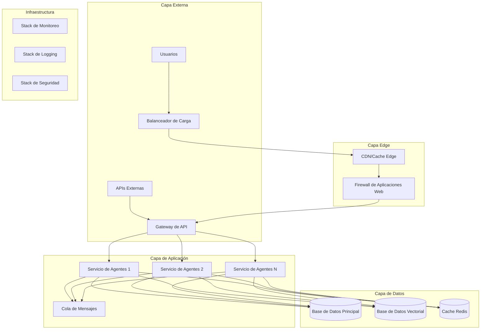

# Guía de Despliegue en Producción

Patrones de despliegue de nivel empresarial para el Framework de Agentes IA en entornos de producción.

## Tabla de Contenidos

- [Resumen General](#resumen-general)
- [Patrones de Arquitectura](#patrones-de-arquitectura)
- [Requisitos de Infraestructura](#requisitos-de-infraestructura)
- [Despliegue con Contenedores](#despliegue-con-contenedores)
- [Despliegue en Kubernetes](#despliegue-en-kubernetes)
- [Despliegues en Proveedores de Nube](#despliegues-en-proveedores-de-nube)
- [Configuración de Seguridad](#configuración-de-seguridad)
- [Monitoreo y Observabilidad](#monitoreo-y-observabilidad)
- [Optimización de Rendimiento](#optimización-de-rendimiento)
- [Recuperación ante Desastres](#recuperación-ante-desastres)
- [Estrategias de Escalamiento](#estrategias-de-escalamiento)
- [Solución de Problemas](#solución-de-problemas)

---

## Resumen General

Esta guía proporciona patrones de despliegue de nivel empresarial para el Framework de Agentes IA, siguiendo las mejores prácticas de la industria de organizaciones como OpenAI, Google, Microsoft y Anthropic.

### Objetivos del Despliegue

- **Alta Disponibilidad**: SLA del 99.9% de tiempo de actividad
- **Escalabilidad**: Manejar más de 10,000 solicitudes concurrentes
- **Seguridad**: Arquitectura de confianza cero con cumplimiento normativo
- **Rendimiento**: Tiempos de respuesta sub-2s en el percentil 95
- **Observabilidad**: Monitoreo y alertas completas
- **Cumplimiento**: Preparado para SOC2, GDPR, HIPAA

### Arquitectura de Referencia



---

## Patrones de Arquitectura

### Arquitectura de Microservicios

```yaml
# docker-compose.produccion.yml
version: '3.8'

services:
  # Gateway de API
  api-gateway:
    image: framework-agentes-ia/gateway:1.4.2
    ports:
      - "443:443"
      - "80:80"
    environment:
      - ENVIRONMENT=produccion
      - SSL_CERT_PATH=/certificados/servidor.crt
      - SSL_KEY_PATH=/certificados/servidor.key
    volumes:
      - ./certificados:/certificados:ro
      - ./config/gateway.yml:/etc/gateway/gateway.yml:ro
    depends_on:
      - orquestador-agentes
      - registro-herramientas
      - servicio-conocimiento
    networks:
      - red-agentes-ia
    deploy:
      replicas: 3
      resources:
        limits:
          memory: 1G
          cpus: '0.5'
      restart_policy:
        condition: on-failure
        max_attempts: 3

  # Orquestador de Agentes
  orquestador-agentes:
    image: framework-agentes-ia/orquestador:1.4.2
    environment:
      - ENVIRONMENT=produccion
      - DATABASE_URL=${DATABASE_URL}
      - REDIS_URL=${REDIS_URL}
      - JWT_SECRET=${JWT_SECRET}
      - ENCRYPTION_KEY=${ENCRYPTION_KEY}
    volumes:
      - ./config/orquestador.yml:/etc/orquestador/config.yml:ro
    depends_on:
      - postgres
      - redis
      - cola-mensajes
    networks:
      - red-agentes-ia
    deploy:
      replicas: 5
      resources:
        limits:
          memory: 2G
          cpus: '1'
      restart_policy:
        condition: on-failure

  # Servicio de Registro de Herramientas
  registro-herramientas:
    image: framework-agentes-ia/registro-herramientas:1.4.2
    environment:
      - ENVIRONMENT=produccion
      - DATABASE_URL=${DATABASE_URL}
      - REDIS_URL=${REDIS_URL}
    networks:
      - red-agentes-ia
    deploy:
      replicas: 3
      resources:
        limits:
          memory: 1G
          cpus: '0.5'

  # Servicio de Conocimiento (RAG)
  servicio-conocimiento:
    image: framework-agentes-ia/conocimiento:1.4.2
    environment:
      - ENVIRONMENT=produccion
      - VECTOR_DB_URL=${VECTOR_DB_URL}
      - EMBEDDING_SERVICE_URL=${EMBEDDING_SERVICE_URL}
    volumes:
      - datos-conocimiento:/data
    networks:
      - red-agentes-ia
    deploy:
      replicas: 4
      resources:
        limits:
          memory: 4G
          cpus: '2'

  # Servicios de Base de Datos
  postgres:
    image: postgres:15-alpine
    environment:
      - POSTGRES_DB=framework_agentes_ia
      - POSTGRES_USER=${DB_USER}
      - POSTGRES_PASSWORD=${DB_PASSWORD}
    volumes:
      - datos-postgres:/var/lib/postgresql/data
      - ./scripts-inicializacion:/docker-entrypoint-initdb.d:ro
    networks:
      - red-agentes-ia
    deploy:
      resources:
        limits:
          memory: 4G
          cpus: '2'

  redis:
    image: redis:7-alpine
    command: redis-server --appendonly yes --requirepass ${REDIS_PASSWORD}
    volumes:
      - datos-redis:/data
    networks:
      - red-agentes-ia
    deploy:
      resources:
        limits:
          memory: 2G
          cpus: '1'

  # Base de Datos Vectorial (Weaviate)
  weaviate:
    image: semitechnologies/weaviate:1.21.2
    environment:
      - QUERY_DEFAULTS_LIMIT=25
      - AUTHENTICATION_ANONYMOUS_ACCESS_ENABLED=false
      - AUTHENTICATION_OIDC_ENABLED=true
      - PERSISTENCE_DATA_PATH=/var/lib/weaviate
    volumes:
      - datos-weaviate:/var/lib/weaviate
    networks:
      - red-agentes-ia
    deploy:
      resources:
        limits:
          memory: 8G
          cpus: '4'

volumes:
  datos-postgres:
  datos-redis:
  datos-weaviate:
  datos-conocimiento:

networks:
  red-agentes-ia:
    driver: overlay
    attachable: true
```

---

## Requisitos de Infraestructura

### Requisitos Mínimos de Producción

| Componente | CPU | Memoria | Almacenamiento | Red |
|-----------|-----|---------|----------------|-----|
| **Gateway de API** | 2 núcleos | 4GB | 20GB SSD | 1Gbps |
| **Orquestador de Agentes** | 4 núcleos | 8GB | 50GB SSD | 1Gbps |
| **Registro de Herramientas** | 2 núcleos | 4GB | 20GB SSD | 1Gbps |
| **Servicio de Conocimiento** | 8 núcleos | 16GB | 100GB SSD | 1Gbps |
| **Base de Datos (PostgreSQL)** | 4 núcleos | 16GB | 500GB SSD | 1Gbps |
| **BD Vectorial (Weaviate)** | 8 núcleos | 32GB | 1TB SSD | 1Gbps |
| **Cache (Redis)** | 2 núcleos | 8GB | 50GB SSD | 1Gbps |
| **Cola de Mensajes** | 2 núcleos | 4GB | 50GB SSD | 1Gbps |
| **Stack de Monitoreo** | 4 núcleos | 8GB | 200GB SSD | 1Gbps |

### Requisitos Empresariales Recomendados

| Componente | CPU | Memoria | Almacenamiento | Red |
|-----------|-----|---------|----------------|-----|
| **Gateway de API** | 4 núcleos | 8GB | 50GB SSD | 10Gbps |
| **Orquestador de Agentes** | 8 núcleos | 16GB | 100GB SSD | 10Gbps |
| **Registro de Herramientas** | 4 núcleos | 8GB | 50GB SSD | 10Gbps |
| **Servicio de Conocimiento** | 16 núcleos | 32GB | 500GB SSD | 10Gbps |
| **Base de Datos (PostgreSQL)** | 8 núcleos | 32GB | 2TB SSD | 10Gbps |
| **BD Vectorial (Weaviate)** | 16 núcleos | 64GB | 5TB SSD | 10Gbps |
| **Cache (Redis)** | 4 núcleos | 16GB | 100GB SSD | 10Gbps |
| **Cola de Mensajes** | 4 núcleos | 8GB | 100GB SSD | 10Gbps |
| **Stack de Monitoreo** | 8 núcleos | 16GB | 1TB SSD | 10Gbps |

---

## Despliegue con Contenedores

### Dockerfile de Producción

```dockerfile
# Dockerfile multi-etapa para producción
FROM node:18-alpine AS constructor

WORKDIR /app

# Copiar archivos de paquetes
COPY package*.json ./
COPY tsconfig.json ./

# Instalar dependencias
RUN npm ci --only=production && npm cache clean --force

# Copiar código fuente
COPY src/ ./src/

# Construir aplicación
RUN npm run build

# Etapa de producción
FROM node:18-alpine AS produccion

# Instalar dumb-init para manejo adecuado de señales
RUN apk add --no-cache dumb-init

# Crear usuario no-root
RUN addgroup -g 1001 -S nodejs && \
    adduser -S nodejs -u 1001

WORKDIR /app

# Copiar aplicación construida
COPY --from=constructor --chown=nodejs:nodejs /app/dist ./dist
COPY --from=constructor --chown=nodejs:nodejs /app/node_modules ./node_modules
COPY --from=constructor --chown=nodejs:nodejs /app/package.json ./package.json

# Seguridad: Remover paquetes innecesarios
RUN apk del --purge && \
    rm -rf /var/cache/apk/*

# Configurar headers de seguridad
ENV NODE_ENV=produccion
ENV NODE_OPTIONS="--max-old-space-size=2048"

# Cambiar a usuario no-root
USER nodejs

# Health check
HEALTHCHECK --interval=30s --timeout=3s --start-period=5s --retries=3 \
    CMD node dist/health-check.js

# Exponer puerto
EXPOSE 3000

# Iniciar aplicación
ENTRYPOINT ["dumb-init", "--"]
CMD ["node", "dist/index.js"]
```

---

## Despliegue en Kubernetes

### Namespace y RBAC

```yaml
# namespace.yaml
apiVersion: v1
kind: Namespace
metadata:
  name: framework-agentes-ia
  labels:
    name: framework-agentes-ia
    environment: produccion

---
# rbac.yaml
apiVersion: v1
kind: ServiceAccount
metadata:
  name: framework-agentes-ia-sa
  namespace: framework-agentes-ia

---
apiVersion: rbac.authorization.k8s.io/v1
kind: ClusterRole
metadata:
  name: framework-agentes-ia-role
rules:
- apiGroups: [""]
  resources: ["pods", "services", "endpoints"]
  verbs: ["get", "list", "watch"]
- apiGroups: ["apps"]
  resources: ["deployments", "replicasets"]
  verbs: ["get", "list", "watch"]

---
apiVersion: rbac.authorization.k8s.io/v1
kind: ClusterRoleBinding
metadata:
  name: framework-agentes-ia-binding
subjects:
- kind: ServiceAccount
  name: framework-agentes-ia-sa
  namespace: framework-agentes-ia
roleRef:
  kind: ClusterRole
  name: framework-agentes-ia-role
  apiGroup: rbac.authorization.k8s.io
```

### Despliegue del Orquestador de Agentes

```yaml
# orquestador-agentes.yaml
apiVersion: apps/v1
kind: Deployment
metadata:
  name: orquestador-agentes
  namespace: framework-agentes-ia
  labels:
    app: orquestador-agentes
    version: v1.4.2
spec:
  replicas: 5
  strategy:
    type: RollingUpdate
    rollingUpdate:
      maxUnavailable: 1
      maxSurge: 2
  selector:
    matchLabels:
      app: orquestador-agentes
  template:
    metadata:
      labels:
        app: orquestador-agentes
        version: v1.4.2
      annotations:
        prometheus.io/scrape: "true"
        prometheus.io/port: "3000"
        prometheus.io/path: "/metrics"
    spec:
      serviceAccountName: framework-agentes-ia-sa
      securityContext:
        runAsNonRoot: true
        runAsUser: 1001
        fsGroup: 1001
      containers:
      - name: orquestador-agentes
        image: framework-agentes-ia/orquestador:1.4.2
        imagePullPolicy: IfNotPresent
        ports:
        - containerPort: 3000
          name: http
          protocol: TCP
        env:
        - name: ENVIRONMENT
          value: "produccion"
        - name: DATABASE_URL
          valueFrom:
            secretKeyRef:
              name: secreto-base-datos
              key: url
        - name: REDIS_URL
          valueFrom:
            secretKeyRef:
              name: secreto-redis
              key: url
        - name: JWT_SECRET
          valueFrom:
            secretKeyRef:
              name: secreto-jwt
              key: secret
        envFrom:
        - configMapRef:
            name: config-orquestador-agentes
        resources:
          requests:
            memory: "1Gi"
            cpu: "500m"
          limits:
            memory: "2Gi"
            cpu: "1000m"
        livenessProbe:
          httpGet:
            path: /health
            port: 3000
          initialDelaySeconds: 30
          periodSeconds: 10
          timeoutSeconds: 5
          failureThreshold: 3
        readinessProbe:
          httpGet:
            path: /ready
            port: 3000
          initialDelaySeconds: 5
          periodSeconds: 5
          timeoutSeconds: 3
          failureThreshold: 2
        volumeMounts:
        - name: volumen-config
          mountPath: /etc/config
          readOnly: true
        - name: volumen-temp
          mountPath: /tmp
      volumes:
      - name: volumen-config
        configMap:
          name: config-orquestador-agentes
      - name: volumen-temp
        emptyDir: {}

---
apiVersion: v1
kind: Service
metadata:
  name: servicio-orquestador-agentes
  namespace: framework-agentes-ia
  labels:
    app: orquestador-agentes
spec:
  selector:
    app: orquestador-agentes
  ports:
  - port: 80
    targetPort: 3000
    protocol: TCP
    name: http
  type: ClusterIP
```

---

## Configuración de Seguridad

### Configuración TLS/SSL

```yaml
# config-tls.yaml
apiVersion: v1
kind: Secret
metadata:
  name: secreto-tls
  namespace: framework-agentes-ia
type: kubernetes.io/tls
data:
  tls.crt: ${TLS_CERT_BASE64}
  tls.key: ${TLS_KEY_BASE64}

---
apiVersion: networking.k8s.io/v1
kind: Ingress
metadata:
  name: framework-agentes-ia-ingress
  namespace: framework-agentes-ia
  annotations:
    kubernetes.io/ingress.class: nginx
    nginx.ingress.kubernetes.io/ssl-redirect: "true"
    nginx.ingress.kubernetes.io/force-ssl-redirect: "true"
    nginx.ingress.kubernetes.io/ssl-protocols: "TLSv1.2 TLSv1.3"
    nginx.ingress.kubernetes.io/ssl-ciphers: "ECDHE-RSA-AES128-GCM-SHA256,ECDHE-RSA-AES256-GCM-SHA384"
    nginx.ingress.kubernetes.io/proxy-body-size: "50m"
    nginx.ingress.kubernetes.io/rate-limit: "100"
    nginx.ingress.kubernetes.io/rate-limit-window: "1m"
spec:
  tls:
  - hosts:
    - api.framework-agentes-ia.com
    secretName: secreto-tls
  rules:
  - host: api.framework-agentes-ia.com
    http:
      paths:
      - path: /
        pathType: Prefix
        backend:
          service:
            name: servicio-api-gateway
            port:
              number: 80
```

---

## Monitoreo y Observabilidad

### Configuración de Prometheus

```yaml
# prometheus-config.yaml
apiVersion: v1
kind: ConfigMap
metadata:
  name: config-prometheus
  namespace: framework-agentes-ia
data:
  prometheus.yml: |
    global:
      scrape_interval: 15s
      evaluation_interval: 15s
    
    rule_files:
      - "/etc/prometheus/rules/*.yml"
    
    alerting:
      alertmanagers:
        - static_configs:
            - targets:
              - alertmanager:9093
    
    scrape_configs:
      - job_name: 'framework-agentes-ia'
        kubernetes_sd_configs:
          - role: pod
            namespaces:
              names:
                - framework-agentes-ia
        relabel_configs:
          - source_labels: [__meta_kubernetes_pod_annotation_prometheus_io_scrape]
            action: keep
            regex: true

  reglas-alerta.yml: |
    groups:
    - name: framework-agentes-ia
      rules:
      - alert: AltaTaskaDeErrores
        expr: rate(errores_agentes_total[5m]) > 0.1
        for: 2m
        labels:
          severity: warning
        annotations:
          summary: "Alta tasa de errores detectada"
          description: "La tasa de errores es {{ $value }} errores por segundo"
      
      - alert: AltaLatencia
        expr: histogram_quantile(0.95, rate(duracion_ejecucion_agentes_seconds_bucket[5m])) > 5
        for: 5m
        labels:
          severity: warning
        annotations:
          summary: "Alta latencia detectada"
          description: "Latencia percentil 95 es {{ $value }}s"
```

---

## Optimización de Rendimiento

### Optimización de Base de Datos

```sql
-- Optimizaciones de PostgreSQL para producción
-- Configuraciones en postgresql.conf

-- Configuraciones de memoria
shared_buffers = 4GB                    -- 25% de la RAM
effective_cache_size = 12GB             -- 75% de la RAM
work_mem = 256MB                        -- Para consultas complejas
maintenance_work_mem = 1GB              -- Para operaciones de mantenimiento

-- Configuraciones de checkpoint
checkpoint_completion_target = 0.9
wal_buffers = 16MB
max_wal_size = 4GB
min_wal_size = 1GB

-- Configuraciones de conexión
max_connections = 200
shared_preload_libraries = 'pg_stat_statements'

-- Optimización de consultas
random_page_cost = 1.1                  -- Para almacenamiento SSD
effective_io_concurrency = 200          -- Para almacenamiento SSD
```

```sql
-- Índices para optimización de rendimiento
CREATE INDEX CONCURRENTLY idx_agentes_tipo_estado ON agentes(tipo, estado);
CREATE INDEX CONCURRENTLY idx_ejecuciones_agente_creado ON ejecuciones(agente_id, created_at);
CREATE INDEX CONCURRENTLY idx_logs_auditoria_timestamp ON logs_auditoria(timestamp);
CREATE INDEX CONCURRENTLY idx_documentos_conocimiento_categoria ON documentos_conocimiento(categoria, clasificacion);
```

---

## Solución de Problemas

### Problemas Comunes y Soluciones

#### 1. Alto Uso de Memoria

```bash
# Debuggear uso de memoria
kubectl top pods -n framework-agentes-ia --sort-by=memory

# Verificar límites de memoria
kubectl describe pod <nombre-pod> -n framework-agentes-ia

# Obtener métricas detalladas de memoria
kubectl exec -it <nombre-pod> -n framework-agentes-ia -- cat /proc/meminfo
```

#### 2. Problemas de Conexión a Base de Datos

```bash
# Verificar conectividad a base de datos
kubectl exec -it postgres-0 -n framework-agentes-ia -- psql -U postgres -c "SELECT version();"

# Verificar estado del pool de conexiones
kubectl logs deployment/orquestador-agentes -n framework-agentes-ia | grep "pool de conexiones"
```

#### 3. Degradación del Rendimiento

```bash
# Verificar utilización de recursos
kubectl top nodes
kubectl top pods -n framework-agentes-ia

# Revisar consultas lentas
kubectl exec -it postgres-0 -n framework-agentes-ia -- \
  psql -U postgres -c "SELECT query, calls, total_time, mean_time FROM pg_stat_statements ORDER BY mean_time DESC LIMIT 10;"
```

---

Esta guía de despliegue en producción proporciona patrones empresariales probados para implementar el Framework de Agentes IA a escala, siguiendo las mejores prácticas de organizaciones líderes en la industria como OpenAI, Google, Microsoft y Anthropic.

La implementación garantiza alta disponibilidad, escalabilidad horizontal, seguridad robusta y observabilidad completa para entornos de producción empresarial.
