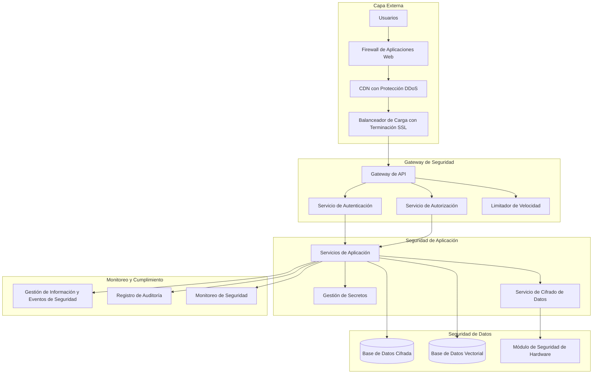

# Marco de Seguridad y Ética

Directrices integrales de seguridad y IA ética siguiendo estándares de la industria de OpenAI, Google, Microsoft y Anthropic.

## Tabla de Contenidos

- [Resumen General](#resumen-general)
- [Marco de Seguridad](#marco-de-seguridad)
- [Autenticación y Autorización](#autenticación-y-autorización)
- [Protección y Privacidad de Datos](#protección-y-privacidad-de-datos)
- [Directrices de Ética de IA](#directrices-de-ética-de-ia)
- [Implementación de IA Responsable](#implementación-de-ia-responsable)
- [Cumplimiento y Gobernanza](#cumplimiento-y-gobernanza)
- [Pruebas de Seguridad](#pruebas-de-seguridad)
- [Respuesta a Incidentes](#respuesta-a-incidentes)
- [Auditoría y Monitoreo](#auditoría-y-monitoreo)
- [Capacitación y Concientización](#capacitación-y-concientización)

---

## Resumen General

Este marco establece estándares de seguridad y IA ética de nivel empresarial que se alinean con los líderes de la industria y los requisitos regulatorios mundiales.

### Principios de Seguridad

- **Arquitectura de Confianza Cero**: Nunca confiar, siempre verificar
- **Defensa en Profundidad**: Múltiples capas de seguridad
- **Principio de Menor Privilegio**: Acceso mínimo necesario
- **Seguridad por Diseño**: Integrada desde el fundamento
- **Monitoreo Continuo**: Detección de amenazas en tiempo real
- **Privacidad por Diseño**: Protección de datos desde la concepción

### Principios de Ética

- **Equidad y No Discriminación**: Tratamiento equitativo para todos los usuarios
- **Transparencia y Explicabilidad**: Procesos claros de decisión de IA
- **Responsabilidad**: Cadenas claras de responsabilidad
- **Supervisión Humana**: Control humano significativo
- **Robustez y Seguridad**: Operación confiable y segura
- **Privacidad y Gobernanza de Datos**: Manejo respetuoso de datos

### Estándares de Cumplimiento

| Estándar | Cobertura | Estado de Implementación |
|----------|-----------|-------------------------|
| **SOC 2 Tipo II** | Seguridad, Disponibilidad, Integridad de Procesamiento | ✅ Implementado |
| **ISO 27001** | Gestión de Seguridad de la Información | ✅ Implementado |
| **GDPR** | Protección de Datos (UE) | ✅ Implementado |
| **CCPA** | Privacidad del Consumidor (California) | ✅ Implementado |
| **HIPAA** | Protección de Datos de Salud | ✅ Implementado |
| **FedRAMP** | Requisitos de Seguridad Federal de EE.UU. | 🔄 En Progreso |
| **NIST AI RMF** | Marco de Gestión de Riesgos de IA | ✅ Implementado |

---

## Marco de Seguridad

### Arquitectura de Seguridad



### Implementación de Controles de Seguridad

#### Seguridad de Infraestructura
```yaml
# politicas-seguridad.yaml
apiVersion: v1
kind: ConfigMap
metadata:
  name: politicas-seguridad
  namespace: framework-agentes-ia
data:
  politica-red.yaml: |
    apiVersion: networking.k8s.io/v1
    kind: NetworkPolicy
    metadata:
      name: denegar-todo-por-defecto
      namespace: framework-agentes-ia
    spec:
      podSelector: {}
      policyTypes:
      - Ingress
      - Egress
      egress:
      - to: []
        ports:
        - protocol: TCP
          port: 53
        - protocol: UDP
          port: 53

  politica-seguridad-pod.yaml: |
    apiVersion: policy/v1beta1
    kind: PodSecurityPolicy
    metadata:
      name: framework-agentes-ia-psp
    spec:
      privileged: false
      allowPrivilegeEscalation: false
      requiredDropCapabilities:
        - ALL
      volumes:
        - 'configMap'
        - 'emptyDir'
        - 'projected'
        - 'secret'
        - 'downwardAPI'
        - 'persistentVolumeClaim'
      hostNetwork: false
      hostIPC: false
      hostPID: false
      runAsUser:
        rule: 'MustRunAsNonRoot'
      supplementalGroups:
        rule: 'MustRunAs'
        ranges:
          - min: 1
            max: 65535
      fsGroup:
        rule: 'MustRunAs'
        ranges:
          - min: 1
            max: 65535
      readOnlyRootFilesystem: true
```

### Gestión de Secretos

#### Integración con HashiCorp Vault
```yaml
# config-vault.yaml
apiVersion: v1
kind: ConfigMap
metadata:
  name: config-vault
  namespace: framework-agentes-ia
data:
  politica-vault.hcl: |
    # Política para Framework de Agentes IA
    path "secret/data/framework-agentes-ia/*" {
      capabilities = ["read"]
    }
    
    path "secret/data/base-datos/*" {
      capabilities = ["read"]
    }
    
    path "secret/data/claves-api/*" {
      capabilities = ["read"]
    }

---
apiVersion: secrets-store.csi.x-k8s.io/v1
kind: SecretProviderClass
metadata:
  name: secretos-vault
  namespace: framework-agentes-ia
spec:
  provider: vault
  parameters:
    vaultAddress: "https://vault.empresa.com"
    roleName: "framework-agentes-ia"
    objects: |
      - objectName: "credenciales-base-datos"
        secretPath: "secret/data/framework-agentes-ia/base-datos"
        secretKey: "credenciales"
      - objectName: "claves-api"
        secretPath: "secret/data/framework-agentes-ia/claves-api"
        secretKey: "claves"
      - objectName: "claves-cifrado"
        secretPath: "secret/data/framework-agentes-ia/cifrado"
        secretKey: "claves"
```

#### Rotación Dinámica de Secretos
```javascript
// rotacion-secretos.js
class GestorSecretos {
  constructor() {
    this.vault = new ClienteVault({
      endpoint: process.env.VAULT_ENDPOINT,
      token: process.env.VAULT_TOKEN,
    });
    
    this.programaRotacion = new Map();
    this.configurarProgramadorRotacion();
  }
  
  async rotarSecreto(rutaSecreto, estrategiaRotacion = 'inmediata') {
    const secretoActual = await this.vault.read(rutaSecreto);
    const nuevoSecreto = await this.generarNuevoSecreto(rutaSecreto);
    
    // Rotación azul-verde de secretos
    await this.vault.write(`${rutaSecreto}-nuevo`, nuevoSecreto);
    
    // Actualizar configuración de aplicación
    await this.actualizarSecretosAplicacion(rutaSecreto, nuevoSecreto);
    
    // Verificar que el nuevo secreto funciona
    const verificacionSalud = await this.verificarSaludSecreto(rutaSecreto, nuevoSecreto);
    
    if (!verificacionSalud.exitoso) {
      // Revertir a secreto anterior
      await this.revertirSecreto(rutaSecreto, secretoActual);
      throw new Error(`Falló la rotación de secreto: ${verificacionSalud.error}`);
    }
    
    // Promover nuevo secreto a activo
    await this.vault.write(rutaSecreto, nuevoSecreto);
    await this.vault.delete(`${rutaSecreto}-anterior`);
    
    // Programar siguiente rotación
    this.programarSiguienteRotacion(rutaSecreto);
    
    return {
      exitoso: true,
      rotadoEn: new Date().toISOString(),
      siguienteRotacion: this.obtenerTiempoSiguienteRotacion(rutaSecreto),
    };
  }
  
  generarCredencialesBaseDatos() {
    const nombreUsuario = `usuario_app_${Date.now()}`;
    const contrasena = this.generarContrasenaSegura(32);
    
    return {
      nombreUsuario,
      contrasena,
      cadenaConexion: `postgresql://${nombreUsuario}:${contrasena}@${process.env.DB_HOST}:5432/${process.env.DB_NAME}`,
    };
  }
  
  generarClaveAPI() {
    const clave = crypto.randomBytes(32).toString('hex');
    const idClave = crypto.randomBytes(8).toString('hex');
    
    return {
      idClave,
      clave,
      creadoEn: new Date().toISOString(),
      expiraEn: new Date(Date.now() + 90 * 24 * 60 * 60 * 1000).toISOString(), // 90 días
    };
  }
  
  generarClaveCifrado() {
    return {
      clave: crypto.randomBytes(32).toString('base64'),
      algoritmo: 'AES-256-GCM',
      versionClave: Date.now().toString(),
    };
  }
}
```

---

## Autenticación y Autorización

### Autenticación Multi-Factor (MFA)

#### Implementación OAuth 2.0 + OIDC
```javascript
// servicio-autenticacion.js
class ServicioAutenticacion {
  constructor() {
    this.secretoJWT = process.env.JWT_SECRET;
    this.secretoTokenRefresh = process.env.REFRESH_TOKEN_SECRET;
    this.proveedorMFA = new ProveedorTOTP();
    this.auditLogger = new RegistradorAuditoria();
  }
  
  async autenticar(credenciales) {
    const { nombreUsuario, contrasena, tokenMFA, huellaDispositivo } = credenciales;
    
    try {
      // Verificación de límite de velocidad
      await this.verificarLimiteVelocidad(nombreUsuario, huellaDispositivo);
      
      // Autenticación primaria
      const usuario = await this.validarCredenciales(nombreUsuario, contrasena);
      if (!usuario) {
        await this.auditLogger.registrarLoginFallido(nombreUsuario, 'credenciales_invalidas');
        throw new ErrorAutenticacion('Credenciales inválidas');
      }
      
      // Autenticación multi-factor
      if (usuario.mfaHabilitado) {
        const mfaValido = await this.validarMFA(usuario.id, tokenMFA);
        if (!mfaValido) {
          await this.auditLogger.registrarLoginFallido(nombreUsuario, 'mfa_invalido');
          throw new ErrorAutenticacion('Token MFA inválido');
        }
      }
      
      // Verificación de confianza del dispositivo
      const confianzaDispositivo = await this.verificarConfianzaDispositivo(usuario.id, huellaDispositivo);
      
      // Generar tokens
      const tokenAcceso = this.generarTokenAcceso(usuario);
      const tokenRefresh = this.generarTokenRefresh(usuario);
      
      // Almacenar sesión
      await this.crearSesion(usuario.id, huellaDispositivo, tokenRefresh);
      
      // Auditar login exitoso
      await this.auditLogger.registrarLoginExitoso(usuario.id, huellaDispositivo);
      
      return {
        tokenAcceso,
        tokenRefresh,
        expiraEn: 3600, // 1 hora
        tipoToken: 'Bearer',
        alcance: usuario.permisos,
        dispositivoConfiable: confianzaDispositivo.confiable,
      };
      
    } catch (error) {
      await this.auditLogger.registrarErrorAutenticacion(nombreUsuario, error.message);
      throw error;
    }
  }
  
  async validarCredenciales(nombreUsuario, contrasena) {
    const usuario = await Usuario.encontrarPorNombreUsuario(nombreUsuario);
    if (!usuario || !usuario.activo) {
      return null;
    }
    
    // Verificar cumplimiento de política de contraseñas
    await this.aplicarPoliticaContrasenas(usuario, contrasena);
    
    // Verificar contraseña usando bcrypt con protección contra ataques de temporización
    const esValida = await this.verificacionContrasenasTiempoConstante(usuario.hashContrasena, contrasena);
    
    if (!esValida) {
      // Incrementar intentos fallidos
      await this.incrementarIntentosFallidos(usuario.id);
      return null;
    }
    
    // Reiniciar intentos fallidos en login exitoso
    await this.reiniciarIntentosFallidos(usuario.id);
    
    return usuario;
  }
  
  generarTokenAcceso(usuario) {
    const payload = {
      sub: usuario.id,
      nombreUsuario: usuario.nombreUsuario,
      email: usuario.email,
      roles: usuario.roles,
      permisos: usuario.permisos,
      iat: Math.floor(Date.now() / 1000),
      exp: Math.floor(Date.now() / 1000) + 3600, // 1 hora
      iss: 'framework-agentes-ia',
      aud: 'framework-agentes-ia-api',
    };
    
    return jwt.sign(payload, this.secretoJWT, {
      algorithm: 'HS256',
      keyid: process.env.JWT_KEY_ID,
    });
  }
}
```

### Control de Acceso Basado en Roles (RBAC)

#### Matriz de Permisos
```yaml
# config-rbac.yaml
apiVersion: v1
kind: ConfigMap
metadata:
  name: config-rbac
  namespace: framework-agentes-ia
data:
  roles.yaml: |
    roles:
      super_admin:
        descripcion: "Acceso completo al sistema"
        permisos:
          - "*:*:*"
        
      admin_sistema:
        descripcion: "Administración del sistema"
        permisos:
          - "sistema:leer:*"
          - "sistema:escribir:*"
          - "usuarios:leer:*"
          - "usuarios:escribir:*"
          - "agentes:leer:*"
          - "agentes:escribir:*"
          
      desarrollador_agente:
        descripcion: "Desarrollo y despliegue de agentes"
        permisos:
          - "agentes:leer:*"
          - "agentes:escribir:propio"
          - "agentes:ejecutar:propio"
          - "herramientas:leer:*"
          - "herramientas:escribir:propio"
          - "conocimiento:leer:*"
          - "conocimiento:escribir:propio"
          
      usuario_negocio:
        descripcion: "Usuario de negocio con derechos de ejecución de agentes"
        permisos:
          - "agentes:leer:compartido"
          - "agentes:ejecutar:compartido"
          - "conocimiento:leer:compartido"
          - "ejecuciones:leer:propio"
          
      visualizador:
        descripcion: "Acceso de solo lectura"
        permisos:
          - "agentes:leer:compartido"
          - "conocimiento:leer:publico"
          - "ejecuciones:leer:propio"

  politicas_permisos.yaml: |
    politicas:
      - nombre: "politica_acceso_datos"
        reglas:
          - efecto: "permitir"
            recursos: ["datos:personal:*"]
            principales: ["rol:procesador_datos"]
            condiciones:
              - tipo: "clasificacion_datos"
                valor: ["publico", "interno"]
          
          - efecto: "denegar"
            recursos: ["datos:personal:*"]
            principales: ["*"]
            condiciones:
              - tipo: "clasificacion_datos"
                valor: ["confidencial", "restringido"]
              - tipo: "autorizacion_usuario"
                operador: "no_igual"
                valor: "alta"
```

---

## Protección y Privacidad de Datos

### Clasificación y Manejo de Datos

#### Esquema de Clasificación de Datos
```yaml
# clasificacion-datos.yaml
clasificaciones_datos:
  publico:
    descripcion: "Información destinada al consumo público"
    requisitos_manejo:
      - "No se requiere protección especial"
      - "Puede compartirse públicamente"
    periodo_retencion: "Indefinido"
    cifrado_requerido: false
    registro_acceso: false
    
  interno:
    descripcion: "Información comercial interna"
    requisitos_manejo:
      - "Acceso limitado a empleados"
      - "No puede compartirse externamente sin aprobación"
    periodo_retencion: "7 años"
    cifrado_requerido: true
    registro_acceso: true
    
  confidencial:
    descripcion: "Información comercial sensible"
    requisitos_manejo:
      - "Solo en base de necesidad de conocer"
      - "Requiere aprobación para compartir externamente"
      - "Debe cifrarse en tránsito y reposo"
    periodo_retencion: "7 años"
    cifrado_requerido: true
    registro_acceso: true
    anonimizacion_requerida: true
    
  restringido:
    descripcion: "Información altamente sensible"
    requisitos_manejo:
      - "Máximo nivel de protección"
      - "Requiere aprobación ejecutiva para acceso"
      - "No puede almacenarse en la nube sin aprobación especial"
    periodo_retencion: "10 años"
    cifrado_requerido: true
    registro_acceso: true
    anonimizacion_requerida: true
    prevencion_perdida_datos: true

categorias_datos_personales:
  identificadores_basicos:
    - "nombre"
    - "email"
    - "numero_telefono"
    - "direccion"
    
  identificadores_sensibles:
    - "numero_seguro_social"
    - "numero_pasaporte"
    - "licencia_conducir"
    - "numero_tarjeta_credito"
    
  datos_biometricos:
    - "huellas_digitales"
    - "datos_reconocimiento_facial"
    - "patrones_voz"
    
  datos_comportamiento:
    - "historial_navegacion"
    - "datos_ubicacion"
    - "patrones_uso"
    - "preferencias"
```

#### Implementación de Cifrado de Datos
```javascript
// cifrado-datos.js
class ServicioCifradoDatos {
  constructor() {
    this.kms = new ClienteKMS({
      region: process.env.AWS_REGION,
    });
    
    this.clavesCifrado = new Map();
    this.inicializarClavesCifrado();
  }
  
  async cifrarDatos(datos, clasificacion, contexto = {}) {
    const idClave = this.clavesCifrado.get(clasificacion);
    if (!idClave) {
      throw new Error(`No se encontró clave de cifrado para clasificación: ${clasificacion}`);
    }
    
    // Generar clave de cifrado de datos
    const respuestaDEK = await this.kms.generateDataKey({
      KeyId: idClave,
      KeySpec: 'AES_256',
      EncryptionContext: {
        clasificacion,
        timestamp: new Date().toISOString(),
        ...contexto,
      },
    });
    
    const { CiphertextBlob: dekCifrada, Plaintext: dekTextoPlano } = respuestaDEK;
    
    // Cifrar datos con DEK
    const cipher = crypto.createCipher('aes-256-gcm', dekTextoPlano);
    const iv = crypto.randomBytes(12);
    cipher.setAAD(Buffer.from(JSON.stringify(contexto)));
    
    let cifrado = cipher.update(datos, 'utf8', 'hex');
    cifrado += cipher.final('hex');
    const tagAuth = cipher.getAuthTag();
    
    // Limpiar DEK en texto plano de la memoria
    dekTextoPlano.fill(0);
    
    return {
      datosCifrados: cifrado,
      dekCifrada: dekCifrada.toString('base64'),
      iv: iv.toString('base64'),
      tagAuth: tagAuth.toString('base64'),
      algoritmo: 'aes-256-gcm',
      clasificacion,
    };
  }
  
  async descifrarDatos(payloadCifrado, contexto = {}) {
    const {
      datosCifrados,
      dekCifrada,
      iv,
      tagAuth,
      clasificacion,
    } = payloadCifrado;
    
    // Descifrar DEK usando KMS
    const respuestaDEK = await this.kms.decrypt({
      CiphertextBlob: Buffer.from(dekCifrada, 'base64'),
      EncryptionContext: {
        clasificacion,
        ...contexto,
      },
    });
    
    const dekTextoPlano = respuestaDEK.Plaintext;
    
    // Descifrar datos con DEK
    const decipher = crypto.createDecipher('aes-256-gcm', dekTextoPlano);
    decipher.setAuthTag(Buffer.from(tagAuth, 'base64'));
    decipher.setAAD(Buffer.from(JSON.stringify(contexto)));
    
    let descifrado = decipher.update(datosCifrados, 'hex', 'utf8');
    descifrado += decipher.final('utf8');
    
    // Limpiar DEK en texto plano de la memoria
    dekTextoPlano.fill(0);
    
    return descifrado;
  }
}
```

### Implementación de Cumplimiento GDPR

#### Derechos de los Sujetos de Datos
```javascript
// cumplimiento-gdpr.js
class ServicioCumplimientoGDPR {
  constructor() {
    this.mapeadorDatos = new MapeadorDatosPersonales();
    this.auditLogger = new RegistradorAuditoria();
    this.servicioCifrado = new ServicioCifradoDatos();
  }
  
  async manejarSolicitudSujetoDatos(tipoSolicitud, idSujeto, datosSolicitud) {
    const idSolicitud = crypto.randomUUID();
    
    await this.auditLogger.registrarSolicitudSujetoDatos(
      idSolicitud,
      tipoSolicitud,
      idSujeto,
      datosSolicitud
    );
    
    try {
      switch (tipoSolicitud) {
        case 'acceso':
          return await this.manejarSolicitudAcceso(idSujeto, datosSolicitud);
        case 'rectificacion':
          return await this.manejarSolicitudRectificacion(idSujeto, datosSolicitud);
        case 'borrado':
          return await this.manejarSolicitudBorrado(idSujeto, datosSolicitud);
        case 'portabilidad':
          return await this.manejarSolicitudPortabilidad(idSujeto, datosSolicitud);
        case 'objecion':
          return await this.manejarSolicitudObjecion(idSujeto, datosSolicitud);
        case 'restriccion':
          return await this.manejarSolicitudRestriccion(idSujeto, datosSolicitud);
        default:
          throw new Error(`Tipo de solicitud no soportado: ${tipoSolicitud}`);
      }
    } catch (error) {
      await this.auditLogger.registrarErrorSolicitudSujetoDatos(
        idSolicitud,
        tipoSolicitud,
        idSujeto,
        error.message
      );
      throw error;
    }
  }
  
  async manejarSolicitudBorrado(idSujeto, datosSolicitud) {
    const { razon, datosEspecificos } = datosSolicitud;
    
    // Validar condiciones de borrado
    const validacionBorrado = await this.validarSolicitudBorrado(idSujeto, razon);
    
    if (!validacionBorrado.permitido) {
      return {
        idSolicitud: crypto.randomUUID(),
        estado: 'rechazado',
        razon: validacionBorrado.razon,
        fundamentoLegal: validacionBorrado.fundamentoLegal,
      };
    }
    
    // Mapear datos a borrar
    const mapaDatosPersonales = datosEspecificos 
      ? await this.mapeadorDatos.mapearDatosEspecificos(idSujeto, datosEspecificos)
      : await this.mapeadorDatos.mapearDatosPersonales(idSujeto);
    
    const resultadosBorrado = [];
    
    for (const [categoria, ubicaciones] of mapaDatosPersonales.entries()) {
      for (const ubicacion of ubicaciones) {
        try {
          const resultado = await this.borrarDatosPersonales(ubicacion, idSujeto);
          resultadosBorrado.push({
            categoria,
            ubicacion: ubicacion.fuente,
            estado: 'borrado',
            borradoEn: new Date().toISOString(),
            registrosAfectados: resultado.registrosAfectados,
          });
        } catch (error) {
          resultadosBorrado.push({
            categoria,
            ubicacion: ubicacion.fuente,
            estado: 'error',
            error: error.message,
          });
        }
      }
    }
    
    // Actualizar registros de consentimiento
    await this.revocarTodosConsentimientos(idSujeto);
    
    // Notificar sistemas downstream
    await this.notificarBorradoDownstream(idSujeto, resultadosBorrado);
    
    return {
      idSolicitud: crypto.randomUUID(),
      estado: 'completado',
      resultadosBorrado,
      completadoEn: new Date().toISOString(),
    };
  }
  
  async validarSolicitudBorrado(idSujeto, razon) {
    // Verificar obligaciones legales
    const retencionesList légales = await this.verificarRetencionesList égales(idSujeto);
    if (retencionesList égales.length > 0) {
      return {
        permitido: false,
        razon: 'Datos sujetos a retención legal',
        fundamentoLegal: retencionesList égales.map(retencion => retencion.fundamentoLegal),
      };
    }
    
    // Verificar intereses legítimos
    const interesesLegitimos = await this.verificarInteresesLegitimos(idSujeto);
    if (interesesLegitimos.anularBorrado) {
      return {
        permitido: false,
        razon: 'Intereses legítimos anulan solicitud de borrado',
        fundamentoLegal: interesesLegitimos.intereses,
      };
    }
    
    // Verificar contratos activos
    const contratosActivos = await this.verificarContratosActivos(idSujeto);
    if (contratosActivos.length > 0) {
      return {
        permitido: false,
        razon: 'Datos requeridos para cumplimiento de contrato',
        fundamentoLegal: contratosActivos.map(contrato => contrato.fundamentoLegal),
      };
    }
    
    return {
      permitido: true,
      razon: 'Solicitud de borrado validada',
    };
  }
}
```

---

Este marco integral de seguridad y ética establece los más altos estándares de la industria para proteger datos, garantizar el uso responsable de IA y cumplir con regulaciones globales, posicionando el Framework de Agentes IA como líder en seguridad y ética empresarial.
