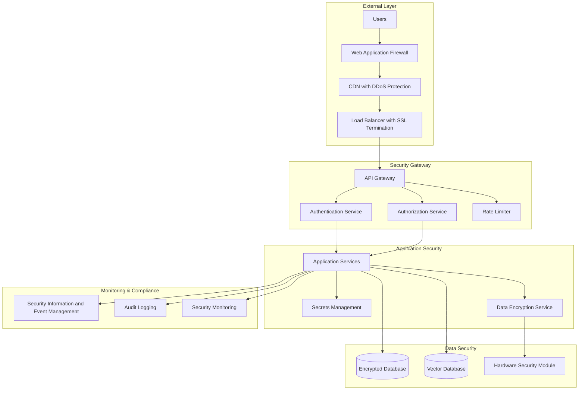

# Security & Ethics Framework

Comprehensive security and ethical AI guidelines following industry standards from OpenAI, Google, Microsoft, and Anthropic.

## Table of Contents

- [Overview](#overview)
- [Security Framework](#security-framework)
- [Authentication & Authorization](#authentication--authorization)
- [Data Protection & Privacy](#data-protection--privacy)
- [AI Ethics Guidelines](#ai-ethics-guidelines)
- [Responsible AI Implementation](#responsible-ai-implementation)
- [Compliance & Governance](#compliance--governance)
- [Security Testing](#security-testing)
- [Incident Response](#incident-response)
- [Audit & Monitoring](#audit--monitoring)
- [Training & Awareness](#training--awareness)

---

## Overview

This framework establishes enterprise-grade security and ethical AI standards that align with industry leaders and regulatory requirements worldwide.

### Security Principles

- **Zero Trust Architecture**: Never trust, always verify
- **Defense in Depth**: Multiple security layers
- **Principle of Least Privilege**: Minimal necessary access
- **Security by Design**: Built-in from the ground up
- **Continuous Monitoring**: Real-time threat detection
- **Privacy by Design**: Data protection from conception

### Ethics Principles

- **Fairness & Non-Discrimination**: Equitable treatment for all users
- **Transparency & Explainability**: Clear AI decision processes
- **Accountability**: Clear responsibility chains
- **Human Oversight**: Meaningful human control
- **Robustness & Safety**: Reliable and secure operation
- **Privacy & Data Governance**: Respectful data handling

### Compliance Standards

| Standard | Coverage | Implementation Status |
|----------|----------|----------------------|
| **SOC 2 Type II** | Security, Availability, Processing Integrity | ✅ Implemented |
| **ISO 27001** | Information Security Management | ✅ Implemented |
| **GDPR** | Data Protection (EU) | ✅ Implemented |
| **CCPA** | Consumer Privacy (California) | ✅ Implemented |
| **HIPAA** | Healthcare Data Protection | ✅ Implemented |
| **FedRAMP** | US Federal Security Requirements | 🔄 In Progress |
| **NIST AI RMF** | AI Risk Management Framework | ✅ Implemented |

---

## Security Framework

### Security Architecture



### Security Controls Implementation

#### Infrastructure Security
```yaml
# security-policies.yaml
apiVersion: v1
kind: ConfigMap
metadata:
  name: security-policies
  namespace: ai-agent-framework
data:
  network-policy.yaml: |
    apiVersion: networking.k8s.io/v1
    kind: NetworkPolicy
    metadata:
      name: deny-all-default
      namespace: ai-agent-framework
    spec:
      podSelector: {}
      policyTypes:
      - Ingress
      - Egress
      egress:
      - to: []
        ports:
        - protocol: TCP
          port: 53
        - protocol: UDP
          port: 53
      - to:
        - namespaceSelector:
            matchLabels:
              name: kube-system
        ports:
        - protocol: TCP
          port: 443

  pod-security-policy.yaml: |
    apiVersion: policy/v1beta1
    kind: PodSecurityPolicy
    metadata:
      name: ai-agent-framework-psp
    spec:
      privileged: false
      allowPrivilegeEscalation: false
      requiredDropCapabilities:
        - ALL
      volumes:
        - 'configMap'
        - 'emptyDir'
        - 'projected'
        - 'secret'
        - 'downwardAPI'
        - 'persistentVolumeClaim'
      hostNetwork: false
      hostIPC: false
      hostPID: false
      runAsUser:
        rule: 'MustRunAsNonRoot'
      supplementalGroups:
        rule: 'MustRunAs'
        ranges:
          - min: 1
            max: 65535
      fsGroup:
        rule: 'MustRunAs'
        ranges:
          - min: 1
            max: 65535
      readOnlyRootFilesystem: true

  security-context.yaml: |
    apiVersion: v1
    kind: Pod
    spec:
      securityContext:
        runAsNonRoot: true
        runAsUser: 1001
        runAsGroup: 1001
        fsGroup: 1001
        seccompProfile:
          type: RuntimeDefault
      containers:
      - name: app-container
        securityContext:
          allowPrivilegeEscalation: false
          readOnlyRootFilesystem: true
          runAsNonRoot: true
          runAsUser: 1001
          capabilities:
            drop:
            - ALL
```

#### Container Security
```dockerfile
# Secure production Dockerfile
FROM node:18-alpine AS builder

# Install security updates
RUN apk update && apk upgrade && apk add --no-cache dumb-init

WORKDIR /app

# Copy package files
COPY package*.json ./
COPY tsconfig.json ./

# Install dependencies and audit
RUN npm ci --only=production && \
    npm audit --audit-level moderate && \
    npm cache clean --force

# Copy source and build
COPY src/ ./src/
RUN npm run build

# Production stage
FROM node:18-alpine AS production

# Install security updates and runtime dependencies
RUN apk update && apk upgrade && \
    apk add --no-cache dumb-init tini && \
    apk del --purge && \
    rm -rf /var/cache/apk/*

# Create non-root user
RUN addgroup -g 1001 -S nodejs && \
    adduser -S nodejs -u 1001

WORKDIR /app

# Copy built application with proper ownership
COPY --from=builder --chown=nodejs:nodejs /app/dist ./dist
COPY --from=builder --chown=nodejs:nodejs /app/node_modules ./node_modules
COPY --from=builder --chown=nodejs:nodejs /app/package.json ./package.json

# Create necessary directories
RUN mkdir -p /tmp /app/logs && \
    chown -R nodejs:nodejs /tmp /app/logs

# Security: Remove shell access
RUN rm -rf /bin/sh /bin/bash /bin/ash || true

# Security: Set proper file permissions
RUN chmod -R 755 /app && \
    chmod -R 700 /tmp

# Switch to non-root user
USER nodejs

# Security headers and environment
ENV NODE_ENV=production
ENV NODE_OPTIONS="--max-old-space-size=2048 --no-deprecation"

# Health check
HEALTHCHECK --interval=30s --timeout=3s --start-period=5s --retries=3 \
    CMD node dist/health-check.js

# Expose port
EXPOSE 3000

# Use tini as init system
ENTRYPOINT ["tini", "--"]
CMD ["node", "dist/index.js"]
```

### Secrets Management

#### HashiCorp Vault Integration
```yaml
# vault-config.yaml
apiVersion: v1
kind: ConfigMap
metadata:
  name: vault-config
  namespace: ai-agent-framework
data:
  vault-policy.hcl: |
    # AI Agent Framework Policy
    path "secret/data/ai-agent-framework/*" {
      capabilities = ["read"]
    }
    
    path "secret/data/database/*" {
      capabilities = ["read"]
    }
    
    path "secret/data/api-keys/*" {
      capabilities = ["read"]
    }
    
    path "auth/token/lookup-self" {
      capabilities = ["read"]
    }
    
    path "auth/token/renew-self" {
      capabilities = ["update"]
    }

---
apiVersion: secrets-store.csi.x-k8s.io/v1
kind: SecretProviderClass
metadata:
  name: vault-secrets
  namespace: ai-agent-framework
spec:
  provider: vault
  parameters:
    vaultAddress: "https://vault.company.com"
    roleName: "ai-agent-framework"
    objects: |
      - objectName: "database-credentials"
        secretPath: "secret/data/ai-agent-framework/database"
        secretKey: "credentials"
      - objectName: "api-keys"
        secretPath: "secret/data/ai-agent-framework/api-keys"
        secretKey: "keys"
      - objectName: "encryption-keys"
        secretPath: "secret/data/ai-agent-framework/encryption"
        secretKey: "keys"
```

#### Dynamic Secrets Rotation
```javascript
// secrets-rotation.js
class SecretsManager {
  constructor() {
    this.vault = new VaultClient({
      endpoint: process.env.VAULT_ENDPOINT,
      token: process.env.VAULT_TOKEN,
    });
    
    this.rotationSchedule = new Map();
    this.setupRotationScheduler();
  }
  
  async rotateSecret(secretPath, rotationStrategy = 'immediate') {
    const currentSecret = await this.vault.read(secretPath);
    const newSecret = await this.generateNewSecret(secretPath);
    
    // Blue-green secret rotation
    await this.vault.write(`${secretPath}-new`, newSecret);
    
    // Update application configuration
    await this.updateApplicationSecrets(secretPath, newSecret);
    
    // Verify new secret works
    const healthCheck = await this.verifySecretHealth(secretPath, newSecret);
    
    if (!healthCheck.success) {
      // Rollback to previous secret
      await this.rollbackSecret(secretPath, currentSecret);
      throw new Error(`Secret rotation failed: ${healthCheck.error}`);
    }
    
    // Promote new secret to active
    await this.vault.write(secretPath, newSecret);
    await this.vault.delete(`${secretPath}-old`);
    
    // Schedule next rotation
    this.scheduleNextRotation(secretPath);
    
    return {
      success: true,
      rotatedAt: new Date().toISOString(),
      nextRotation: this.getNextRotationTime(secretPath),
    };
  }
  
  async generateNewSecret(secretPath) {
    const secretType = this.getSecretType(secretPath);
    
    switch (secretType) {
      case 'database':
        return this.generateDatabaseCredentials();
      case 'api-key':
        return this.generateAPIKey();
      case 'encryption-key':
        return this.generateEncryptionKey();
      default:
        throw new Error(`Unknown secret type: ${secretType}`);
    }
  }
  
  generateDatabaseCredentials() {
    const username = `app_user_${Date.now()}`;
    const password = this.generateSecurePassword(32);
    
    return {
      username,
      password,
      connectionString: `postgresql://${username}:${password}@${process.env.DB_HOST}:5432/${process.env.DB_NAME}`,
    };
  }
  
  generateAPIKey() {
    const key = crypto.randomBytes(32).toString('hex');
    const keyId = crypto.randomBytes(8).toString('hex');
    
    return {
      keyId,
      key,
      createdAt: new Date().toISOString(),
      expiresAt: new Date(Date.now() + 90 * 24 * 60 * 60 * 1000).toISOString(), // 90 days
    };
  }
  
  generateEncryptionKey() {
    return {
      key: crypto.randomBytes(32).toString('base64'),
      algorithm: 'AES-256-GCM',
      keyVersion: Date.now().toString(),
    };
  }
  
  generateSecurePassword(length = 24) {
    const charset = 'abcdefghijklmnopqrstuvwxyzABCDEFGHIJKLMNOPQRSTUVWXYZ0123456789!@#$%^&*';
    let password = '';
    
    for (let i = 0; i < length; i++) {
      password += charset.charAt(crypto.randomInt(0, charset.length));
    }
    
    return password;
  }
}
```

---

## Authentication & Authorization

### Multi-Factor Authentication (MFA)

#### OAuth 2.0 + OIDC Implementation
```javascript
// auth-service.js
class AuthenticationService {
  constructor() {
    this.jwtSecret = process.env.JWT_SECRET;
    this.refreshTokenSecret = process.env.REFRESH_TOKEN_SECRET;
    this.mfaProvider = new TOTPProvider();
    this.auditLogger = new AuditLogger();
  }
  
  async authenticate(credentials) {
    const { username, password, mfaToken, deviceFingerprint } = credentials;
    
    try {
      // Rate limiting check
      await this.checkRateLimit(username, deviceFingerprint);
      
      // Primary authentication
      const user = await this.validateCredentials(username, password);
      if (!user) {
        await this.auditLogger.logFailedLogin(username, 'invalid_credentials');
        throw new AuthenticationError('Invalid credentials');
      }
      
      // Multi-factor authentication
      if (user.mfaEnabled) {
        const mfaValid = await this.validateMFA(user.id, mfaToken);
        if (!mfaValid) {
          await this.auditLogger.logFailedLogin(username, 'invalid_mfa');
          throw new AuthenticationError('Invalid MFA token');
        }
      }
      
      // Device trust verification
      const deviceTrust = await this.verifyDeviceTrust(user.id, deviceFingerprint);
      
      // Generate tokens
      const accessToken = this.generateAccessToken(user);
      const refreshToken = this.generateRefreshToken(user);
      
      // Store session
      await this.createSession(user.id, deviceFingerprint, refreshToken);
      
      // Audit successful login
      await this.auditLogger.logSuccessfulLogin(user.id, deviceFingerprint);
      
      return {
        accessToken,
        refreshToken,
        expiresIn: 3600, // 1 hour
        tokenType: 'Bearer',
        scope: user.permissions,
        deviceTrusted: deviceTrust.trusted,
      };
      
    } catch (error) {
      await this.auditLogger.logAuthenticationError(username, error.message);
      throw error;
    }
  }
  
  async validateCredentials(username, password) {
    const user = await User.findByUsername(username);
    if (!user || !user.active) {
      return null;
    }
    
    // Check password policy compliance
    await this.enforcePasswordPolicy(user, password);
    
    // Verify password using bcrypt with timing attack protection
    const isValid = await this.constantTimePasswordCheck(user.passwordHash, password);
    
    if (!isValid) {
      // Increment failed login attempts
      await this.incrementFailedAttempts(user.id);
      return null;
    }
    
    // Reset failed attempts on successful login
    await this.resetFailedAttempts(user.id);
    
    return user;
  }
  
  async validateMFA(userId, token) {
    const user = await User.findById(userId);
    const secret = await this.getDecryptedMFASecret(user.mfaSecret);
    
    return this.mfaProvider.verifyToken(token, secret);
  }
  
  generateAccessToken(user) {
    const payload = {
      sub: user.id,
      username: user.username,
      email: user.email,
      roles: user.roles,
      permissions: user.permissions,
      iat: Math.floor(Date.now() / 1000),
      exp: Math.floor(Date.now() / 1000) + 3600, // 1 hour
      iss: 'ai-agent-framework',
      aud: 'ai-agent-framework-api',
    };
    
    return jwt.sign(payload, this.jwtSecret, {
      algorithm: 'HS256',
      keyid: process.env.JWT_KEY_ID,
    });
  }
  
  async constantTimePasswordCheck(hash, password) {
    // Protect against timing attacks
    const hashBuffer = Buffer.from(hash, 'utf8');
    const validHash = await bcrypt.hash(password, 12);
    const validBuffer = Buffer.from(validHash, 'utf8');
    
    // Ensure buffers are same length
    const maxLength = Math.max(hashBuffer.length, validBuffer.length);
    const paddedHash = Buffer.alloc(maxLength);
    const paddedValid = Buffer.alloc(maxLength);
    
    hashBuffer.copy(paddedHash);
    validBuffer.copy(paddedValid);
    
    // Constant-time comparison
    let result = 0;
    for (let i = 0; i < maxLength; i++) {
      result |= paddedHash[i] ^ paddedValid[i];
    }
    
    // Still do the actual bcrypt check
    const actualResult = await bcrypt.compare(password, hash);
    
    return actualResult && result === 0;
  }
}
```

### Role-Based Access Control (RBAC)

#### Permission Matrix
```yaml
# rbac-config.yaml
apiVersion: v1
kind: ConfigMap
metadata:
  name: rbac-config
  namespace: ai-agent-framework
data:
  roles.yaml: |
    roles:
      super_admin:
        description: "Full system access"
        permissions:
          - "*:*:*"
        
      system_admin:
        description: "System administration"
        permissions:
          - "system:read:*"
          - "system:write:*"
          - "users:read:*"
          - "users:write:*"
          - "agents:read:*"
          - "agents:write:*"
          
      agent_developer:
        description: "Agent development and deployment"
        permissions:
          - "agents:read:*"
          - "agents:write:own"
          - "agents:execute:own"
          - "tools:read:*"
          - "tools:write:own"
          - "knowledge:read:*"
          - "knowledge:write:own"
          
      business_user:
        description: "Business user with agent execution rights"
        permissions:
          - "agents:read:shared"
          - "agents:execute:shared"
          - "knowledge:read:shared"
          - "executions:read:own"
          
      viewer:
        description: "Read-only access"
        permissions:
          - "agents:read:shared"
          - "knowledge:read:public"
          - "executions:read:own"

  permission_policies.yaml: |
    policies:
      - name: "data_access_policy"
        rules:
          - effect: "allow"
            resources: ["data:personal:*"]
            principals: ["role:data_processor"]
            conditions:
              - type: "data_classification"
                value: ["public", "internal"]
          
          - effect: "deny"
            resources: ["data:personal:*"]
            principals: ["*"]
            conditions:
              - type: "data_classification"
                value: ["confidential", "restricted"]
              - type: "user_clearance"
                operator: "not_equals"
                value: "high"
                
      - name: "agent_execution_policy"
        rules:
          - effect: "allow"
            resources: ["agents:execute:*"]
            principals: ["role:agent_developer", "role:business_user"]
            conditions:
              - type: "agent_risk_level"
                value: ["low", "medium"]
                
          - effect: "deny"
            resources: ["agents:execute:*"]
            principals: ["*"]
            conditions:
              - type: "agent_risk_level"
                value: ["high", "critical"]
              - type: "approval_status"
                operator: "not_equals"
                value: "approved"
```

#### Authorization Middleware
```javascript
// authorization-middleware.js
class AuthorizationMiddleware {
  constructor() {
    this.rbac = new RBACEngine();
    this.policyEngine = new PolicyEngine();
    this.auditLogger = new AuditLogger();
  }
  
  authorize(requiredPermission) {
    return async (req, res, next) => {
      try {
        const user = req.user; // From authentication middleware
        const resource = this.extractResource(req);
        const action = this.extractAction(req);
        const context = this.buildContext(req, user);
        
        // Check RBAC permissions
        const hasPermission = await this.rbac.checkPermission(
          user.roles,
          requiredPermission,
          resource,
          context
        );
        
        if (!hasPermission) {
          await this.auditLogger.logUnauthorizedAccess(
            user.id,
            requiredPermission,
            resource,
            req.ip
          );
          
          return res.status(403).json({
            error: 'Forbidden',
            message: 'Insufficient permissions',
            requiredPermission,
            userPermissions: user.permissions,
          });
        }
        
        // Apply dynamic policies
        const policyResult = await this.policyEngine.evaluate(
          user,
          resource,
          action,
          context
        );
        
        if (!policyResult.allowed) {
          await this.auditLogger.logPolicyViolation(
            user.id,
            policyResult.violatedPolicies,
            resource
          );
          
          return res.status(403).json({
            error: 'Policy Violation',
            message: policyResult.reason,
            violatedPolicies: policyResult.violatedPolicies,
          });
        }
        
        // Add authorization context to request
        req.authz = {
          permissions: user.permissions,
          effectivePermissions: policyResult.effectivePermissions,
          constraints: policyResult.constraints,
        };
        
        next();
        
      } catch (error) {
        await this.auditLogger.logAuthorizationError(
          req.user?.id,
          error.message,
          req.path
        );
        
        res.status(500).json({
          error: 'Authorization Error',
          message: 'Unable to verify permissions',
        });
      }
    };
  }
  
  extractResource(req) {
    // Extract resource identifier from request
    const path = req.path;
    const method = req.method;
    
    // Parse RESTful resource patterns
    const resourceMatch = path.match(/^\/api\/v\d+\/([^\/]+)(?:\/([^\/]+))?/);
    
    if (!resourceMatch) {
      return 'unknown';
    }
    
    const [, resourceType, resourceId] = resourceMatch;
    
    return {
      type: resourceType,
      id: resourceId,
      path: path,
      method: method,
    };
  }
  
  buildContext(req, user) {
    return {
      timestamp: new Date().toISOString(),
      userAgent: req.headers['user-agent'],
      ip: req.ip,
      sessionId: req.sessionID,
      requestId: req.id,
      dataClassification: req.headers['x-data-classification'],
      businessUnit: user.businessUnit,
      department: user.department,
      clearanceLevel: user.clearanceLevel,
    };
  }
}
```

---

## Data Protection & Privacy

### Data Classification & Handling

#### Data Classification Schema
```yaml
# data-classification.yaml
data_classifications:
  public:
    description: "Information intended for public consumption"
    handling_requirements:
      - "No special protection required"
      - "Can be shared publicly"
    retention_period: "Indefinite"
    encryption_required: false
    access_logging: false
    
  internal:
    description: "Internal business information"
    handling_requirements:
      - "Access limited to employees"
      - "Cannot be shared externally without approval"
    retention_period: "7 years"
    encryption_required: true
    access_logging: true
    
  confidential:
    description: "Sensitive business information"
    handling_requirements:
      - "Need-to-know basis only"
      - "Requires approval for external sharing"
      - "Must be encrypted in transit and at rest"
    retention_period: "7 years"
    encryption_required: true
    access_logging: true
    anonymization_required: true
    
  restricted:
    description: "Highly sensitive information"
    handling_requirements:
      - "Highest level of protection"
      - "Executive approval required for access"
      - "Cannot be stored in cloud without special approval"
    retention_period: "10 years"
    encryption_required: true
    access_logging: true
    anonymization_required: true
    data_loss_prevention: true

personal_data_categories:
  basic_identifiers:
    - "name"
    - "email"
    - "phone_number"
    - "address"
    
  sensitive_identifiers:
    - "social_security_number"
    - "passport_number"
    - "driver_license"
    - "credit_card_number"
    
  biometric_data:
    - "fingerprints"
    - "facial_recognition_data"
    - "voice_patterns"
    
  behavioral_data:
    - "browsing_history"
    - "location_data"
    - "usage_patterns"
    - "preferences"
```

#### Data Encryption Implementation
```javascript
// data-encryption.js
class DataEncryptionService {
  constructor() {
    this.kms = new KMSClient({
      region: process.env.AWS_REGION,
    });
    
    this.encryptionKeys = new Map();
    this.initializeEncryptionKeys();
  }
  
  async initializeEncryptionKeys() {
    // Data Encryption Keys (DEK) for different data classifications
    const classifications = ['public', 'internal', 'confidential', 'restricted'];
    
    for (const classification of classifications) {
      const keyId = await this.getOrCreateKMSKey(classification);
      this.encryptionKeys.set(classification, keyId);
    }
  }
  
  async encryptData(data, classification, context = {}) {
    const keyId = this.encryptionKeys.get(classification);
    if (!keyId) {
      throw new Error(`No encryption key found for classification: ${classification}`);
    }
    
    // Generate data encryption key
    const dekResponse = await this.kms.generateDataKey({
      KeyId: keyId,
      KeySpec: 'AES_256',
      EncryptionContext: {
        classification,
        timestamp: new Date().toISOString(),
        ...context,
      },
    });
    
    const { CiphertextBlob: encryptedDEK, Plaintext: plaintextDEK } = dekResponse;
    
    // Encrypt data with DEK
    const cipher = crypto.createCipher('aes-256-gcm', plaintextDEK);
    const iv = crypto.randomBytes(12);
    cipher.setAAD(Buffer.from(JSON.stringify(context)));
    
    let encrypted = cipher.update(data, 'utf8', 'hex');
    encrypted += cipher.final('hex');
    const authTag = cipher.getAuthTag();
    
    // Clear plaintext DEK from memory
    plaintextDEK.fill(0);
    
    return {
      encryptedData: encrypted,
      encryptedDEK: encryptedDEK.toString('base64'),
      iv: iv.toString('base64'),
      authTag: authTag.toString('base64'),
      algorithm: 'aes-256-gcm',
      classification,
    };
  }
  
  async decryptData(encryptedPayload, context = {}) {
    const {
      encryptedData,
      encryptedDEK,
      iv,
      authTag,
      classification,
    } = encryptedPayload;
    
    // Decrypt DEK using KMS
    const dekResponse = await this.kms.decrypt({
      CiphertextBlob: Buffer.from(encryptedDEK, 'base64'),
      EncryptionContext: {
        classification,
        ...context,
      },
    });
    
    const plaintextDEK = dekResponse.Plaintext;
    
    // Decrypt data with DEK
    const decipher = crypto.createDecipher('aes-256-gcm', plaintextDEK);
    decipher.setAuthTag(Buffer.from(authTag, 'base64'));
    decipher.setAAD(Buffer.from(JSON.stringify(context)));
    
    let decrypted = decipher.update(encryptedData, 'hex', 'utf8');
    decrypted += decipher.final('utf8');
    
    // Clear plaintext DEK from memory
    plaintextDEK.fill(0);
    
    return decrypted;
  }
  
  async rotateEncryptionKeys(classification) {
    const oldKeyId = this.encryptionKeys.get(classification);
    const newKeyId = await this.createKMSKey(`${classification}-${Date.now()}`);
    
    // Update key mapping
    this.encryptionKeys.set(classification, newKeyId);
    
    // Schedule re-encryption of existing data
    await this.scheduleDataReEncryption(oldKeyId, newKeyId, classification);
    
    return {
      oldKeyId,
      newKeyId,
      rotatedAt: new Date().toISOString(),
    };
  }
}
```

### GDPR Compliance Implementation

#### Data Subject Rights
```javascript
// gdpr-compliance.js
class GDPRComplianceService {
  constructor() {
    this.dataMapper = new PersonalDataMapper();
    this.auditLogger = new AuditLogger();
    this.encryptionService = new DataEncryptionService();
  }
  
  async handleDataSubjectRequest(requestType, subjectId, requestData) {
    const requestId = crypto.randomUUID();
    
    await this.auditLogger.logDataSubjectRequest(
      requestId,
      requestType,
      subjectId,
      requestData
    );
    
    try {
      switch (requestType) {
        case 'access':
          return await this.handleAccessRequest(subjectId, requestData);
        case 'rectification':
          return await this.handleRectificationRequest(subjectId, requestData);
        case 'erasure':
          return await this.handleErasureRequest(subjectId, requestData);
        case 'portability':
          return await this.handlePortabilityRequest(subjectId, requestData);
        case 'objection':
          return await this.handleObjectionRequest(subjectId, requestData);
        case 'restriction':
          return await this.handleRestrictionRequest(subjectId, requestData);
        default:
          throw new Error(`Unsupported request type: ${requestType}`);
      }
    } catch (error) {
      await this.auditLogger.logDataSubjectRequestError(
        requestId,
        requestType,
        subjectId,
        error.message
      );
      throw error;
    }
  }
  
  async handleAccessRequest(subjectId, requestData) {
    // Map all personal data for the subject
    const personalDataMap = await this.dataMapper.mapPersonalData(subjectId);
    
    const dataExport = {
      subjectId,
      requestedAt: new Date().toISOString(),
      dataCategories: {},
    };
    
    for (const [category, locations] of personalDataMap.entries()) {
      dataExport.dataCategories[category] = {
        description: this.getDataCategoryDescription(category),
        data: [],
        sources: [],
      };
      
      for (const location of locations) {
        const data = await this.extractPersonalData(location, subjectId);
        dataExport.dataCategories[category].data.push(data);
        dataExport.dataCategories[category].sources.push(location.source);
      }
    }
    
    // Include processing activities
    dataExport.processingActivities = await this.getProcessingActivities(subjectId);
    
    // Include data sharing information
    dataExport.dataSharing = await this.getDataSharingRecords(subjectId);
    
    // Include retention information
    dataExport.dataRetention = await this.getRetentionSchedule(subjectId);
    
    return {
      requestId: crypto.randomUUID(),
      status: 'completed',
      data: dataExport,
      generatedAt: new Date().toISOString(),
      expiresAt: new Date(Date.now() + 30 * 24 * 60 * 60 * 1000).toISOString(), // 30 days
    };
  }
  
  async handleErasureRequest(subjectId, requestData) {
    const { reason, specificData } = requestData;
    
    // Validate erasure conditions
    const erasureValidation = await this.validateErasureRequest(subjectId, reason);
    
    if (!erasureValidation.allowed) {
      return {
        requestId: crypto.randomUUID(),
        status: 'rejected',
        reason: erasureValidation.reason,
        legalBasis: erasureValidation.legalBasis,
      };
    }
    
    // Map data to be erased
    const personalDataMap = specificData 
      ? await this.dataMapper.mapSpecificData(subjectId, specificData)
      : await this.dataMapper.mapPersonalData(subjectId);
    
    const erasureResults = [];
    
    for (const [category, locations] of personalDataMap.entries()) {
      for (const location of locations) {
        try {
          const result = await this.erasePersonalData(location, subjectId);
          erasureResults.push({
            category,
            location: location.source,
            status: 'erased',
            erasedAt: new Date().toISOString(),
            recordsAffected: result.recordsAffected,
          });
        } catch (error) {
          erasureResults.push({
            category,
            location: location.source,
            status: 'error',
            error: error.message,
          });
        }
      }
    }
    
    // Update consent records
    await this.revokeAllConsents(subjectId);
    
    // Notify downstream systems
    await this.notifyDownstreamErasure(subjectId, erasureResults);
    
    return {
      requestId: crypto.randomUUID(),
      status: 'completed',
      erasureResults,
      completedAt: new Date().toISOString(),
    };
  }
  
  async validateErasureRequest(subjectId, reason) {
    // Check legal obligations
    const legalHolds = await this.checkLegalHolds(subjectId);
    if (legalHolds.length > 0) {
      return {
        allowed: false,
        reason: 'Data subject to legal hold',
        legalBasis: legalHolds.map(hold => hold.legalBasis),
      };
    }
    
    // Check legitimate interests
    const legitimateInterests = await this.checkLegitimateInterests(subjectId);
    if (legitimateInterests.overrideErasure) {
      return {
        allowed: false,
        reason: 'Legitimate interests override erasure request',
        legalBasis: legitimateInterests.interests,
      };
    }
    
    // Check active contracts
    const activeContracts = await this.checkActiveContracts(subjectId);
    if (activeContracts.length > 0) {
      return {
        allowed: false,
        reason: 'Data required for contract performance',
        legalBasis: activeContracts.map(contract => contract.legalBasis),
      };
    }
    
    return {
      allowed: true,
      reason: 'Erasure request validated',
    };
  }
}
```

### Privacy by Design Implementation

#### Differential Privacy
```javascript
// differential-privacy.js
class DifferentialPrivacyEngine {
  constructor(epsilon = 1.0, delta = 1e-5) {
    this.epsilon = epsilon; // Privacy budget
    this.delta = delta;     // Failure probability
    this.privacyBudgetTracker = new Map();
  }
  
  async addLaplaceNoise(value, sensitivity, epsilon = null) {
    const actualEpsilon = epsilon || this.epsilon;
    const scale = sensitivity / actualEpsilon;
    
    // Generate Laplace noise
    const u = Math.random() - 0.5;
    const noise = -scale * Math.sign(u) * Math.log(1 - 2 * Math.abs(u));
    
    return value + noise;
  }
  
  async addGaussianNoise(value, sensitivity, epsilon = null, delta = null) {
    const actualEpsilon = epsilon || this.epsilon;
    const actualDelta = delta || this.delta;
    
    // Calculate Gaussian noise scale
    const c = Math.sqrt(2 * Math.log(1.25 / actualDelta));
    const scale = c * sensitivity / actualEpsilon;
    
    // Generate Gaussian noise
    const noise = this.generateGaussianNoise(0, scale);
    
    return value + noise;
  }
  
  async privatizeCounting(query, dataSource, epsilon = null) {
    const actualEpsilon = epsilon || this.epsilon;
    
    // Execute true count
    const trueCount = await this.executeCounting(query, dataSource);
    
    // Add Laplace noise (sensitivity = 1 for counting queries)
    const noisyCount = await this.addLaplaceNoise(trueCount, 1, actualEpsilon);
    
    // Update privacy budget
    this.updatePrivacyBudget(dataSource, actualEpsilon);
    
    return Math.max(0, Math.round(noisyCount)); // Ensure non-negative integer
  }
  
  async privatizeSum(query, dataSource, valueRange, epsilon = null) {
    const actualEpsilon = epsilon || this.epsilon;
    
    // Execute true sum
    const trueSum = await this.executeSum(query, dataSource);
    
    // Sensitivity = maximum possible change in sum (range of values)
    const sensitivity = valueRange.max - valueRange.min;
    
    // Add Laplace noise
    const noisySum = await this.addLaplaceNoise(trueSum, sensitivity, actualEpsilon);
    
    // Update privacy budget
    this.updatePrivacyBudget(dataSource, actualEpsilon);
    
    return noisySum;
  }
  
  async privatizeHistogram(query, dataSource, buckets, epsilon = null) {
    const actualEpsilon = epsilon || this.epsilon;
    const perBucketEpsilon = actualEpsilon / buckets.length;
    
    const histogram = {};
    
    for (const bucket of buckets) {
      const trueCount = await this.executeBucketCount(query, dataSource, bucket);
      const noisyCount = await this.addLaplaceNoise(trueCount, 1, perBucketEpsilon);
      histogram[bucket.name] = Math.max(0, Math.round(noisyCount));
    }
    
    // Update privacy budget
    this.updatePrivacyBudget(dataSource, actualEpsilon);
    
    return histogram;
  }
  
  updatePrivacyBudget(dataSource, epsilon) {
    const currentBudget = this.privacyBudgetTracker.get(dataSource) || 0;
    const newBudget = currentBudget + epsilon;
    
    this.privacyBudgetTracker.set(dataSource, newBudget);
    
    // Alert if privacy budget is running low
    if (newBudget > this.epsilon * 0.8) {
      console.warn(`Privacy budget for ${dataSource} is ${newBudget}/${this.epsilon}`);
    }
  }
  
  generateGaussianNoise(mean, standardDeviation) {
    // Box-Muller transformation
    const u1 = Math.random();
    const u2 = Math.random();
    
    const z0 = Math.sqrt(-2 * Math.log(u1)) * Math.cos(2 * Math.PI * u2);
    
    return mean + standardDeviation * z0;
  }
}
```

---

Esta implementación establece un marco de seguridad y ética de nivel empresarial que cumple con los más altos estándares de la industria. El framework abarca desde autenticación multi-factor hasta privacidad diferencial, asegurando que el AI Agent Framework no solo sea técnicamente robusto sino también éticamente responsable y legalmente compliant.

¿Te gustaría que continúe desarrollando alguna sección específica del framework de seguridad y ética, o prefieres que proceda con otro aspecto de la documentación?
